# ESL Extraction Of SMD Shunt Resistors Using FDTD Simulation

High power current shunt resistors are necessarily among the larger surface-mount components. Since they also have to be cost-effective, they cannot simply be built on exotic substrates like CVD diamond (thermal conductivity: 2200 W/m·K) or BeO (325 W/m·K). 

Generally, even AlN (193 W/m·K) is cost-prohibitive, and ZTA / Al2O3 substrates are used (20 W/m·K). What's more, these resistors do not use extra substrate area to dissipate heat and instead rely on cooling via their terminals.

Preferably, commercial shunt resistors would be used which have a geometry and trimming pattern benign enough to cause a flat frequency dependence of ESL.

In the following, we will look at commercial resistor structures, trimming patterns and how they relate to their wideband performance, to finally simulate a chosen resistor type with the FDTD method.

## Trimming Patterns - Which Part To Pick?

As brought up in [1], a shunt resistor in 2010 format (5025 metric) may be trimmed such that the RF current path differs significantly from the DC path. The picture below illustrates rather well that these metal film resistors are not very precise when manufactured, or deliberately designed such that the choke points with the greatest heat production are near the terminals, as opposed to in the center of the resistor chip. At any rate, they are not homogenous:

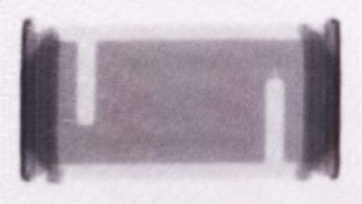

In fact, the triming patterns are so large that it can be assumed that intermediate resistance values are created from  fewer unique patterns. Such variability has also been found through visual inspection of a range of values of Susumu RKL resistors. This may be due to cost-savings in production, but essentially causes unpredictable patterns for various values from the same manufacturer, series and date of production. 

In [2], a 2.0x resistance change is demonstrated by introducing an L-cut with additional shadow cut for fine trimming:

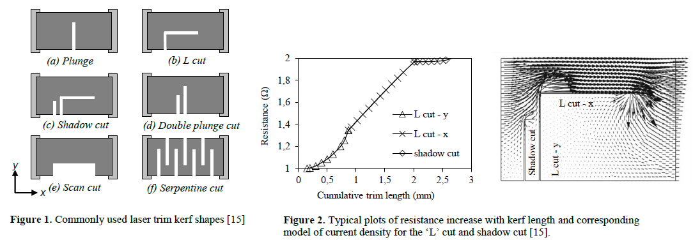

More interestingly, a Vishay Technical Note [3] goes into more detail as to which impact the trimming pattern has on the high frequency behavior of a paritcular type of resistor. 0603 and 0402 are already rather small resistors with yet smaller resistive element dimenions, yet the impact of the trimming method manifests already above 200 MHz:

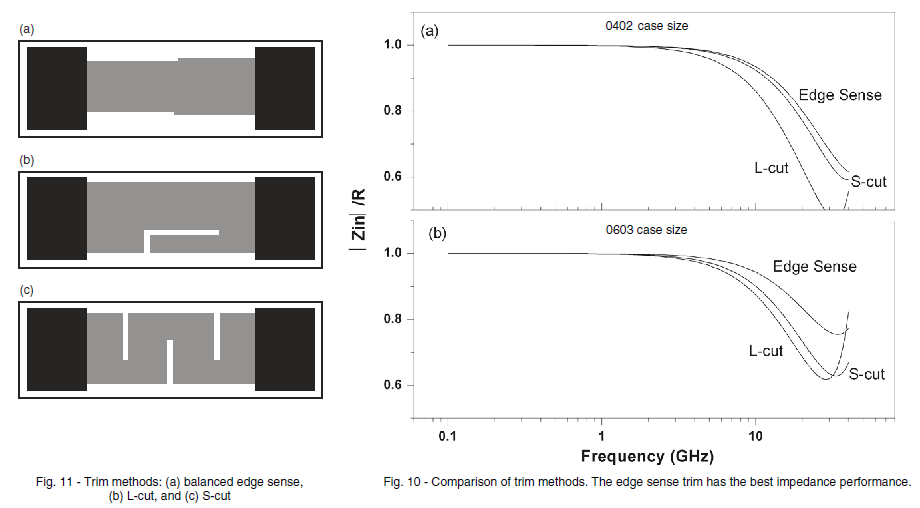

Thus, the actual trimming pattern and method cannot be ignored, and resistor values may need to be adjusted based on the practical findings for a particular batch. 

One of the few resistor types which promises to be more benign is **Susumu RL7520W** [4], which just consists of 6 paralleled resistive elements the size of 0805 resistors:

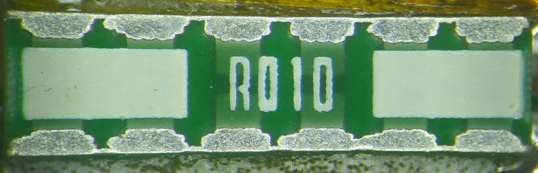

Such an array was used with good results in earlier experiments, and can be thought of as a fall-back strategy should Susumu discontinue the RL7520W product.

## Specified Equivalent Series Inductance (ESL) As A Function Of Frequency

It's a rare sight - power resistors are rarely characterized for wide-band applications - but Susumu provide a diagram with tentative characteristics of a selection of shunt resistor geometries:

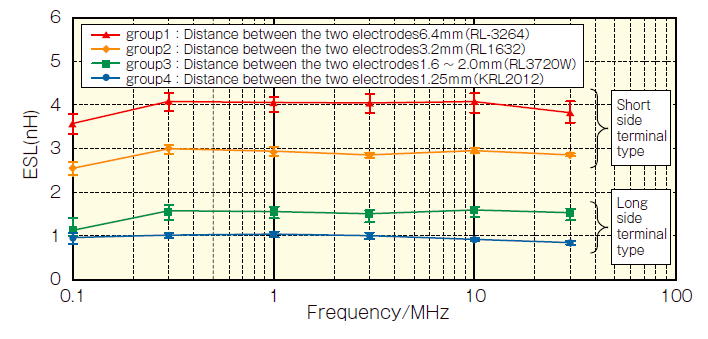

It truly speaks to Susumu's diligence that they performed measurements and provide these graphs, since the measurement itself it non-trivial when measuring what is effectively a short circuit in an RF geometry. The subject of shunt resistor resistance and ESL measurement is covered in application notes by IB Billmann [5] in excellent detail while keeping it compact, and may be revisited at a later point in time. Key challenges are identified, among others, as high dynamic range requirements (80 - 110 dB), small signal levels, and round loop currents that need to be isolated.

We were also able to receive preliminary data for their newer RKL series:

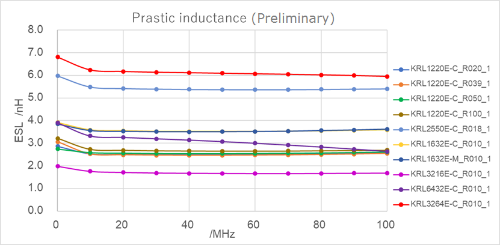

The problem with KRL shunt resistors is that they rely on S-cut trimming similar to what the initial x-ray picture shows, except in a wide terminal resistor format.

The Parasitic Inductance graph above really drives home the insight that despite their considerable absolute ESL, some of the resistors listed may be well suitable for wideband applications and show excellent flatness from 10 to 100 MHz.

The origin of the deviation in the 0.1 to 10 MHz range cannot be explained without further information on the laboratory setup used. It should probably also not be overrated, considering that the RL measurements show a trend towards lower values, also without giving an explanation for said trend. In [6] some measurement techniques are explained based on the Bode-100. Among these are variants of the shunt-thru measurement:

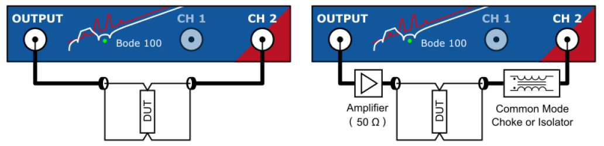

To get a cursory idea, a ~10 mOhm resistor is connecte to a 50 Ohm coaxial cable, and the connection of the device under test creates a ground loop. To quote [6] on shunt-thru measurements:

	The Shunt-Thru configuration inherently suffers a ground-loop error at low frequencies. The
	current flowing thru the cable shield of the connection to Channel 2 ground introduces a
	measurement error that can become significant at frequencies below 10 kHz to 100 kHz
	when measuring very low impedance values. To suppress respectively reduce the ground-loop error at low
	frequencies, use a common-mode choke or common-mode transformer or
	an active isolation device. Note that the Shunt-Thru transformation from S21 to impedance
	assumes 50 Ω as source impedance and input impedance.

The RL, and especially KRL series data is relevant there because then one can compare
* datasheet values
* FDTD simulation results, and
* own experimental measurement results

against each other.

## RL7520W Geometrical Model

To set up a simulation, a geometrical model which reasonably approximates the RL7520W shunt resistor is needed. Dimensions can be estimated from a microscopic image (some distortion correction applied, uncalibrated image, assuming a height of 2.0 mm in the center of the image):

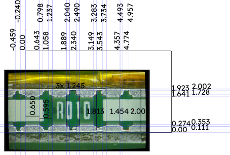

Other dimensions and tolerances are given in the datasheet:

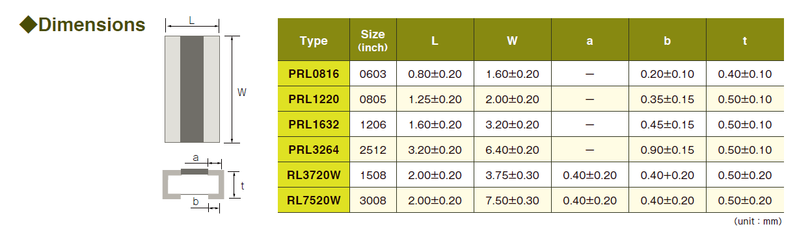

A missing parameter seems to be the metalization thickness which will be assumed to be 50 µm for the following calculations, and can be adjusted in a parametric model when a cross-sectional image has been acquired from a sample prepared for this purpose.

With these values, a parametric model can be set up, addressing RL3720W and RL7520W simulatoin needs:

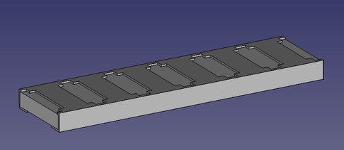

Should actual resistive elements be needed for the simulation, then they can be removed from the model made of a conductor (PEC) and added as an array of individual bodies or a 2D sheet with resistivity (see OpenEMS example [MSL_Losses.m](https://github.com/thliebig/openEMS/blob/master/matlab/examples/transmission_lines/MSL_Losses.m)). 

## Test Fixtures

Next, a test fixture needs to be specified, both for design, and for electrical validation. Some design aspects can be gleaned from a shunt-thru test fixture for  interdigital capacitor (IDC) specimen [7]: 

	It is desirable to make the test board capacitance as low as possible, that is, 
	the length and width dimensions are made small, so that board resonances 
	are as high as possible and above the frequency range of interest for the 
	decoupling capacitor. Test boards used for this work are 1 cm square and are 
	made with Getek, a low K (3.8) and low loss dielectric suitable for 
	measurements in the GHz range.

The PCB assembly and reference measurements with a solid short circuit are summarized in the figures below: a 10x10 mm board made of a suitable "functionalized polyphenylene oxide (PPO)/epoxy resin reinforced with glass fabric" (specified up to 10 GHz) is designed with very low prepreg thickness and total board thickness, while the test points are on the backside:

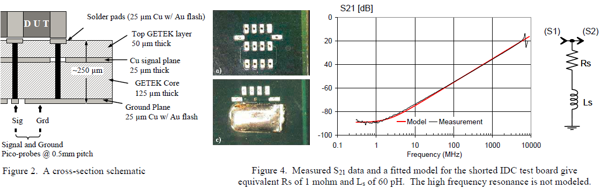

On the other hand, the series-thru fixture for primarily inductive bond wire structures described in [8] is first and foremost a micro-strip line geometry and specified with an eye on easing 3D modeling and FDTD simulation:

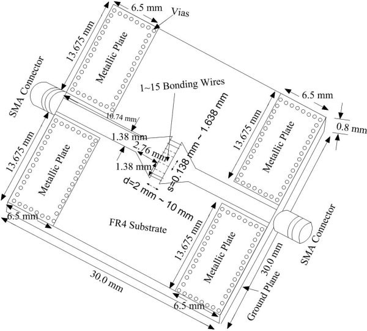

As long as we are interested in ESL rather than in R as a function of frequency, a series-thru measurement setup might be advantageous both in practical setups and in an FDTD simulation setting, but it raises questions: How does one best transition from the MSL geometry to a 7.5 mm long shunt? Does the taper need to be included in the simulation, or can a wide port be used? Does a simulation configured to run at significantly lower system impedance yield better results than at 50 Ohm?

## Simulation Setup

(to be continued)

## Results 

(to be continued)

## References

1. https://www.eevblog.com/forum/testgear/measuring-~1-nh-parasitic-inductance-in/ - image shown here has been processed to remove coherent noise with 2D FFT by using Gimp with GMIC: https://www.fosshub.com/GMIC.html
2. https://www.researchgate.net/publication/291419037_Resistor_trimming_geometry_past_present_and_future
3. Vishay, Technical Note, "Frequency Response of Thin Film Chip Resistors", https://www.vishay.com/docs/60107/freqresp.pdf
4. [Susumu RL series](https://www.mouser.de/datasheet/2/392/n_catalog_partition07_en-1114612.pdf) datasheet. Product page: https://www.susumu.co.jp/usa/product/category.php?cid=7
5. IB Billmann, Application Notes, http://www.ib-billmann.de/koax_e.php#apnot 
6. Bode-100 User manual, https://www.omicron-lab.com/fileadmin/assets/Bode_100/Manuals/Bode-100-User-Manual-ENU10060503.pdf
7. I. Novak, ["Inductance of Bypass Capacitors How to Define, How to Measure, How to Simulate"](http://www.electrical-integrity.com/Paper_download_files/DC05East_TFMP2.pdf) (2005), Corpus ID: 73670119
8. Chen, H.-Y., & Su, C.-P. (2008). Investigation of return loss for large numbers of bonding wires by FDTD method. Microwave and Optical Technology Letters, 50(6), 1575–1579. [doi:10.1002/mop.23425](https://doi.org/10.1002/mop.23425)

