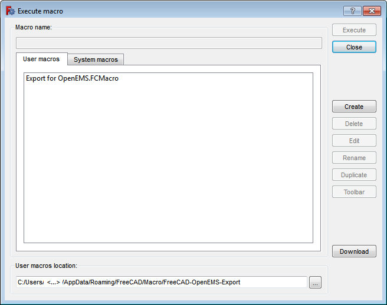
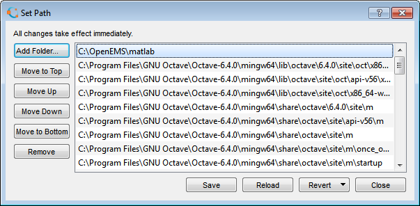

# From FreeCAD to OpenEMS

Required:

* FreeCAD for mechanical CAD
* FreeCAD-OpenEMS-Export for problem configuration
* Octave for script execution
* OpenEMS itself with its FDTD solvers and visualization

Additionally,

* ParaView to inspect results


## Setup

Starting point: a setup tutorial (silent, somewhat unstructured): https://www.youtube.com/watch?v=OR-79dCMdyo . The necessary steps are untangled and listed below in an updated form.

### OpenEMS

https://openems.de/index.php/OpenEMS.html#Windows

* Download https://openems.de/download/win64/openEMS_x64_v0.0.35-74-g0e54fbf.zip
* extract to ``c:\OpenEMS\``
* add ``;c:\OpenEMS`` to user ``PATH`` variable

```
C:\Users\<username>\where OpenEMS
C:\OpenEMS\openEMS.exe
```

### FreeCAD

#### installer

https://www.freecadweb.org/downloads.php

#### latest

Remove old files in installation folder and extract archive into it.

Weekly builds with Python 3.8 (thank you for preserving support for Windows 7, at least up to FreeCAD 0.21!):

https://github.com/FreeCAD/FreeCAD-Bundle/releases/tag/weekly-builds


### FreeCAD-OpenEMS-Export setup and export assistant

The export tool is not a workbench, but a macro, and currently not available via Extension Manager. The FreeCAD folder for macros is

``` C:\Users\<username>\AppData\Roaming\FreeCAD\Macro ```

to which *FreeCAD-OpenEMS-Export* can be copied or cloned

* by downloading the repository as .zip from https://github.com/LubomirJagos/FreeCAD-OpenEMS-Export and extracting to the macro folder
* by opening the command prompt in the macro folder and running   
```git clone https://github.com/LubomirJagos/FreeCAD-OpenEMS-Export.git```

Currently there can only be one *User macros location* for all .FCMacro files, but it is recommended to keep the cloned repository in its folder for better handling. This will require manual configuration of the macros location each time a different macro is being executed.

Creating a hardlink does not work, as it causes the script to be run with the parent folder as the current working directory, and modules imported by ```Export for OpenEMS.FCMacro``` will not be found.



```fsutil hardlink create  "<...>\Macro\Export for OpenEMS.FCMacro"  "<...>\Macro\FreeCAD-OpenEMS-Export\Export for OpenEMS.FCMacro"```

There is probably a workaround / way to forward it but as simple as adding a forwarder script with ``imp.load_source()`` in it.

### Octave

For some reason, Octave 7.1 freezes when starting, so we shall try Octave 6.4.

https://mirrors.tripadvisor.com/gnu/octave/windows/ 

https://mirrors.tripadvisor.com/gnu/octave/windows/octave-6.4.0-w64-installer.exe

Run Octave.  

Via ``Edit > Set Path > Add Folder ...`` add ``C:\OpenEMS\matlab`` :



To execute one of the examples,

* set ``File Explorer`` path to ``C:/OpenEMS/matlab/examples``
* navigate to an example
* copy explorer directory to ``Current Directory``
* press ``Save File and Run/Continue``. 
* Switch to ``Command Window`` if necessary.

### ParaView

The latest ParaView versions (and older ones required for Windows 7 use)  can be downloaded at https://www.paraview.org/download/ .

For Windows 7, use the last build with Python 3.8: 

[ParaView-5.9.1-MPI-Windows-Python3.8-msvc2017-64bit.exe](https://www.paraview.org/paraview-downloads/download.php?submit=Download&version=v5.9&type=binary&os=Windows&downloadFile=ParaView-5.9.1-MPI-Windows-Python3.8-msvc2017-64bit.exe)