# Microstrip Transmission Line With A Stub

If you're interested in antennas, high-frequency simulation of circuit structures, custom components (e.g. magnetics) and a mix of CAD models and lumped components working as a circuit, FDTD may be for you. Below is a first example that should help to get a foot on the ground with OpenEMS and the other tools involved.

<table border="0"><tr>
<td style="text-align:right">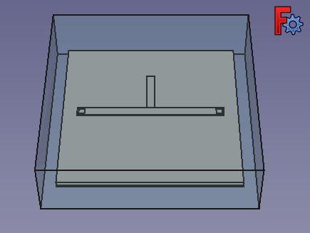</td>
<td style="vertical-align:center">&rarr;</td>
<td style="text-align:left">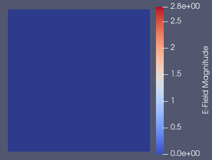</td>
</tr></table>

Caveat: The model is not dimensionally accurate and will probably have a mismatched impedance. Dimensions are chosen to avoid having to obsess over mesh generation details and to improve the chances of first-pass success. To make up for that, information on how to do it right is also given, and tutorials and official OpenEMS documentation are referenced for further reading. The author welcomes corrections and suggestions to promote best practices.

# Problem Setup

Setting up the first problem may feel like a daunting task, which is unfortunately more a function of the unrealized user-friendliness of the tools involved than one of the physical problem itself. With the required applications set up and working, the actual workflow is composed of the following steps:

1. Select appropriate physical phenomena and solver method (EM fields and currents, OpenEMS is an **FDTD** solver) - consider whether FEM or FDTD is appropriate for the questions you seek to answer
2. **Create appropriate geometry** or import and pre-process it
3. **Create new material definitions** or selecting them from an integrated library
4. **Associate materials with all objects in the simulation volume**
5. Specify the "test bench" 
	* Simulation parameters (**excitation type, frequency range**)
	* **Ports** and lumped components
	* **Boundary conditions**
6. Manually **generate a mesh**

Nuisance challenges related to OpenEMS (at the time of this writing):

* Lack of a materials library and its GUI integration?
* Lack of physics- and geometry-informed and automated mesh generation. Maybe it will be attractive to pivot to [pyems](https://github.com/matthuszagh/pyems) in the future which claims to support [automatic mesh generation](https://github.com/matthuszagh/pyems#automatic-mesh-generation-algorithm).
* Unstable mesh preview in FreeCAD (mesh can be previewed at script runtime in Octave, which starts AppCSXCAD).

## 1. Physical Phenomena and Solver Method

The example presented below assumes that the reader is to some extent familiar with 2D FEM solvers for electromagnetic problems and has used e.g. [FEMM](https://www.femm.info/wiki/HomePage) or [Agros2D](http://www.agros2d.org/), but needs to investigate 3D problems, and do so at higher frequencies.

[FreeFEM](https://freefem.org/) is a powerful multiphysics 3D FEM solver and probably the superior open source choice for electro- and magnetostatics, heat transport, mechanical and fluid dynamics problems. If most questions can be answered by performing a static or single frequency (frequency domain) analysis, choose the finite element method.

OpenEMS implements the  [finite-difference time-domain method](https://en.wikipedia.org/wiki/Finite-difference_time-domain_method#FDTD_models_and_methods) or Yee's method for 3D  problems. The key defining feature of FDTD is the broadband (Gaussian) excitation in the time domain, allowing the frequency response of a structure to be obtained from a Fourier transform. It also allows to obtain a more intuitive access to transient phenomena like the propagation of a step impulse corresponding to time-domain reflectometry measurements. 

"EC-FDTD" stands for equivalent-circuit FDTD, a method for calculating FDTD coefficients internally and of minor importance to the user, so OpenEMS can generally be referred to as an FDTD solver.

**Here we use OpenEMS, and an FDTD analysis will be performed** to obtain the frequency response of a strip line with a stub attached to it, as it is one of the simplest designs that may come to mind. Whether stubs can be tolerated in PCB design is a recurring question in the RF circuit design learning process, as it's not easy to avoid them when placing bypass capacitors, termination resistors or even via barrels through multiple layers or the entire PCB. Ultimately, one could even investigate 90°, 45° and rounded corners in PCB traces to further one's understanding of transmission line behavior at very high frequencies. These learning opportunities make OpenEMS an attractive option for teaching and self-study.

<!-- Want more on the inner workings of FEM and FDTD approaches? Check out https://www.youtube.com/watch?v=K5csAeV23S0 -->

## 2. Creating Geometry

For the purposes of this example it serves to keep things simple. Simulation geometry is, in most cases, a stylized excerpt of a bigger piece of circuitry, and the general approach to produce it relies on

* [Defeaturing](https://doi.org/10.1016/j.mcm.2012.06.019) / smoothing - when a mesh is automatically generated, fine details that do not impact fields and energy density to an appreciable degree can be removed. Additionally, sharp corners result in high E field strengths and do not necessarily have a manufactured equivelent.
* Symmetries and lower dimensionality - a universal need to lower simulation time drives a-priori reduction of the number of elements / cells. This is what makes tools like FEMM popular, as it simulates axisymmetric and extruded cartesian geometries, assuming that the end caps only introduce a minor deviation / contribution when comparing the 2D simplification to the real 3D model.
* Prioritization of speed or accuracy - certainly within a significant margin of discretion, and even more so when an order-of-magnitude impact on computation time is taken into account.
* Meshing trickery - tayloring of the mesh to be just fine enough to properly capture the physics.

Especially the last point, the design of a mesh informed by prior knowledge of results and typical manifestation of the underlying physics (here Maxwell's equations) can be perceived as a hurdle when getting started. So let us not assume prior knowledge of what an efficient FDTD mesh is, at least for now. Later, there will arise a natural need for objective quality and stability criteria, as simulations may simply fail or show physically implausible behavior (e.g. ringing at the edges of a step excitation after propagating through a microstrip transmission line, infinite or zero energy, resonances that do not correspond to physical lengths and circuit elements implemented in the model).

For simplicity, open  `` 002.FCStd``  from the [example project folder](example_stub_filter/) to follow along.

Below is a brief overview over the (unorganized) objects that make up a printed circuit board in FreeCAD, with 2 layers and 1.5 mm thick FR4. The tracks are made very thick to ensure at least 1-2 grid lines (actually grid planes)  lie inside the conductor:

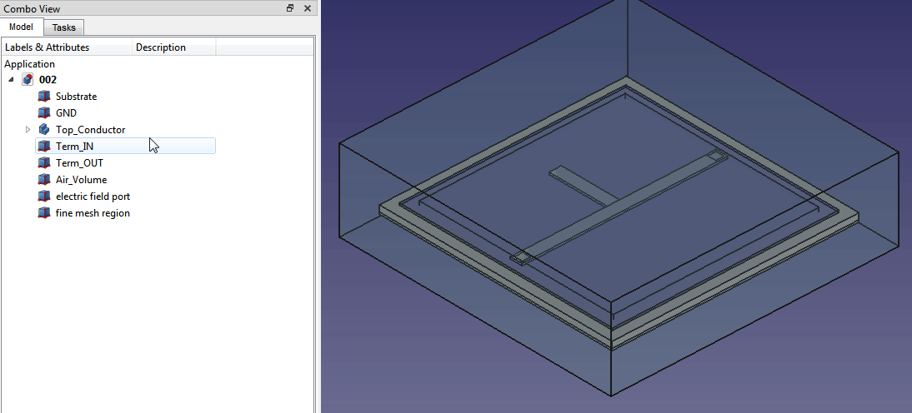

The geometry is made up of:

*  50x3x0.5 mm copper trace and
*  15x3x0.5 mm copper stub on top of a
*  60x60x1.5 mm FR4 block (Substrate), below which another 
*  60x60x0.5 mm copper block (GND) is placed.
*  2x2x2.5 mm blocks placed across the top and bottom layers for ports pointing in z-direction (Term_IN, Term_OUT).

The size of the simulation (or air) volume is small and based on some naive assumptions: the E field is mostly confined to the substrate and the edges of traces. The 3W rule from PCB design (minimum distance between PCB traces that are not intentionally coupled / show only a minor amount of interference) and the traces being over an uninterrupted groundplane are taken as an orientation. 

For now, let's assume that the structure will not radiate efficiently and the field strength 1.5 cm above the PCB is small. More on the boundary conditions below.

The validation of those assumptions through addition of another E field port plane ~ 10mm above the top trace to inspect the free space field strength is left to the inclined reader once the simulation produces results.

Three helper volumes are added:

* 70x70x20 mm simulation volume (Air_Volume),
* 50x50x3 mm fine mesh region
* 55x55x0.5 mm region in which the E field will be investigated.

In the Part workbench, select + CTRL-D or right-click item "Appearance.." easily allows to reduce the transparency. These blocks can be hidden (select + Space) to work on the geometry inside.

**Note that currently the names should not be changed after this point to avoid errors and loss of assignments in  FreeCAD-OpenEMS Exporter.**

Term_IN and Term_OUT blocks are placeholders for

## 3. Material Definitions

### Defining Materials in OpenEMS

Material Property assignments are assisted by FreeCAD-OpenEMS exporter.  The wizard does not add extra complexity beyond the selection between ``userDefined material``  and ``metal`` .

Over at http://openems.de/index.php/Material_Property a brief summary is given:
* Epsilon: relative electric permittivity (must be >=1)
* Mue: relative magnetic permeability (must be >=1)
* Kappa: electric conductivity (must be >=0)
* Sigma: magnetic conductivity (non-physical property, must be >=0)

Perfect conductors, and also lossy thin sheets can be specified as well (see https://openems.de/index.php/Metal_Property.html):

* A perfect electric conductor(PEC) property is added by``CSX = AddMetal(CSX, name)``
* or a lossy conducting material can be added by  ``CSX = AddConductingSheet(CSX, name, conductivity, thickness)``

As per http://openems.de/forum/viewtopic.php?t=163 , ``AddConductingSheet()`` is a 2D property, mapping a thin film onto a surface for simulation. 3D volumes with this property produce an error:

	Operator_Ext_ConductingSheet::BuildExtension: 
	A conducting sheet primitive (ID: 2) with dimension: 3 found, fallback to PEC! 

It appears that ``AddConductingSheet()`` is not represented in FreeCAD-OpenEMS export, probably on account of requiring a 2D object and / or a region that only contains one mesh line (clarification needed - [here](https://github.com/thliebig/openEMS/blob/master/matlab/examples/transmission_lines/MSL_Losses.m) it is used in conjunction with ``AddBox()`` ).

### Materials Used

Luckily, specifying material properties is not a lenghty process. 
* for all materials used here ``Sigma = 0`` and ``Mue = 1``
* air can be set to ``Epsilon = 1``, ``Kappa = 0``
* FR4 is roughly ``Epsilon = 4.5", ``Kappa = 0``
* The copper layer is modeled as a metal, or rather a perfect electrical conductor (PEC)

FreeCAD-OpenEMS Export appeared to insist on creating a ``PEC`` metal:

```Matlab
CSX = AddMetal( CSX, 'PEC' );
``` 

which leads to further complaints when it goes unused for reasons that are not clear to the author at the point of writing.

One can however create a metal material also named ``PEC`` which subsequently overwrites the orphaned material definition and serves as our definition for copper.  

## 4. Associating Materials With Objects

Materials are assigned in the ``Object Assignments`` tab shown below. All solid material blocks are disjoint in our model. Solids also sit inside or intersect ``Air_Volume`` and ``fine mesh region`` The zone priorities are negotiated through the list position on the right hand side. Note that ``fine mesh region`` is not used to specify a material, as materials are already specified at all positions in the simulation volume. ``fine mesh region`` also takes precedent over ``Air_Volume`` associated with ``grid_coarse`` properties.

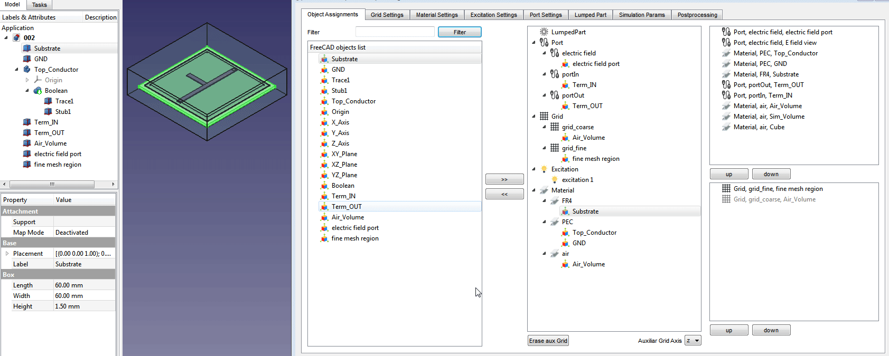

Also refer to this animation for the property values under ``Grid Settings`` and ``Port Settings`` mentioned below.

## 5. Completing The Problem Definition

### Ports

See https://openems.de/index.php/Ports.html , where it is stated:

	Ports are macro functions that combine e.g. current and voltage probes, 
	field excitations and other necessary properties and primitives.
	
The concept of a port is thus not simply a contact point akin to an SMA or u.fl connector point. One could perhaps consider all cells *not connected* to a port region to be *internal* or *hidden* cells, while others associated with a port definition are either connected to external sources, loads or field and potential probes. 

In circuit terms, we intend to consider our design connected to a source with its input, and e.g. an oscilloscope at the output:

	Concentrated ports such as the lumped or curve port are supposed to be 
	very small and compact ports. Their size should be much smaller than the wavelength.

* ``Port_In`` : lumped, 50 Ohm active port in +z direction
* ``Port_Out`` : lumped, 50 Ohm non-active port in +z direction (termination)

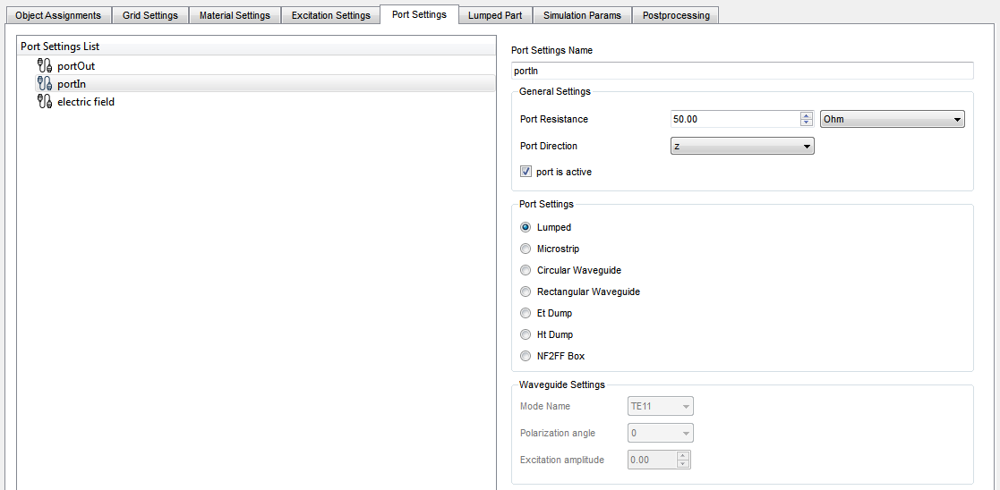

To observe a particular region of the simulation volume, an E field dump is configured. One could observe the entire volume for all times, but often only particular section planes are of interest. 

* ``electric field`` : Et dump region observing the field distribution, a plane with +z normal direction 

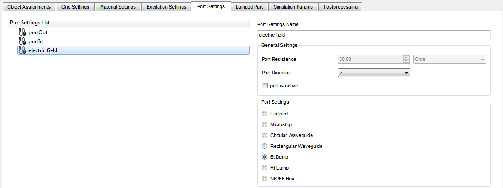

Volumetric information on the other hand is of interest e.g. when simulating cavities and waveguides, as well as near fields of radiating structures.

### Excitation

See http://openems.de/index.php/Excitation . Various excitation types are possible, including an analytical function when using ``FDTD = SetCustomExcite(FDTD,f0,funcStr)``. Here, we choose Gaussian excitation over ``2.5 +/- 2 GHz`` .

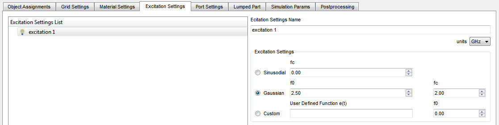

### Solver Options

* maximum timestep :  100000 (an abort criterion which may not be reached as during Gaussian excitation, the simulation should hit a minimum energy dispersion (-30 dB) threshold first.
* min decrement : 0.001 (?)

https://openems.de/index.php/Frequently_Asked_Questions.html : 

    My timestep seems to be very small and the simulation takes a long time. Why?
    
	A (very) small timestep usually means that the mesh contains one or more cells 
	that are very small. The timestep is defined by the smallest cell. If you really 
	need small cells (e.g. to resolve some important feature of your structure) 
	you will have to live with long execution times or perhaps FDTD is not the 
	right method for your problem. In most cases you should check if you can
	avoid small cells.

In the FreeCAD-OpenEMS Exporter dialog, the Simulation Params tab also contains the boundary condition settings which we will look at next.

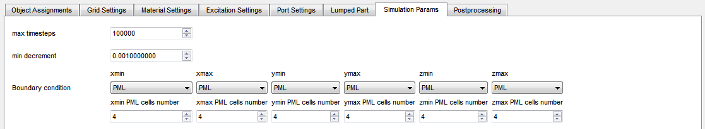

### Boundary Conditions

Boundary conditions are an essential part of a physical problem definition. They immediately interact with the set of solutions. For free-space scenarios, the perfectly matched layer is appropriate. Unlike boundary conditions that prescribe specific values for E and B fields on a surface, PMLs are several cells thick.

In other cases, a metal enclosure can be represented through perfect electric conductor (PEC) boundaries.

Also see http://openems.de/index.php/FDTD_Boundary_Conditions for a comprehensive list of boundary conditions supported in OpenEMS.

#### Perfectly Matched Layer (PML)

 The boundary conditions [(perfectly matched layer, PML)](https://web.stanford.edu/group/fan/publication/Shin_JCP_231_3406_2012.pdf) are chosen to pretend the circuit is surrounded by infinite free space - they provide termination with free-space / vacuum impedance. 
 
 The animation below is excellent at illustrating why the PML region needs to be several cells thick - fields propagate into the PML, where they dissipate.


*Source: [EMPossible Lecture 13 (FDTD) -- The Perfectly Matched Layer](https://www.youtube.com/watch?v=w_NnRZlNuAA)*

**Warning: In openEMS the last x lines in the respective direction are defined as this artificial absorbing material: Keep your structures far enough away!**

## 6. Meshing

Arguably the most inconvenient aspect of OpenEMS and is its lack of automated mesh generation, and in some tutorials it might appear that the diffusion of implicit knowledge from code snippets to the reader should suffice. For now, OpenEMS problems are limited to cylinder coordinates, as well as cartesian coordinates and structured grids  (see also http://openems.de/index.php/FDTD_Mesh for the example below):

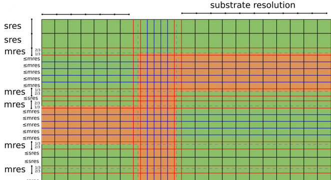

In the future, automatic mesh generation and unstructured grids may be added, which will probably go hand-in-hand with automated mesh generation:

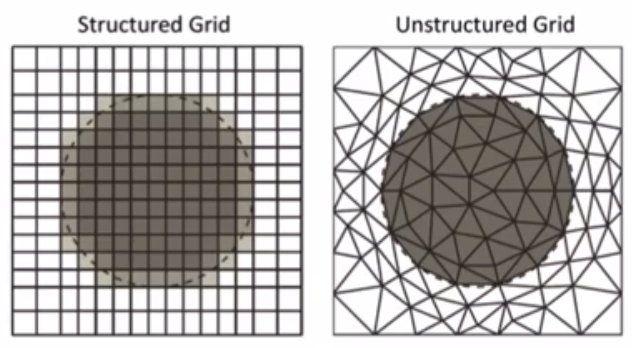

<!--source:  https://www.youtube.com/watch?v=AJ8w2InCojA -->

As shown above, two nested mesh regions are defined in this example:

* ``grid_coarse``: 1 x 1 x 1 mm cell size
* ``grid_fine``: 1 x 1 x 0.25 mm cell size

From AppCSXCAD run later, the refinement in the z-direction is visible. In principle, cell dimensions should only vary by a factor of 2 from cell to cell, but we shall try 1 mm and 0.25 mm here for simplicity, making the refined mesh region thicker in hopes that the strongest field gradients are directly at the height of the top side metal layer, leaving a few cells thick layer between the metal and the transition in the grid spacing.

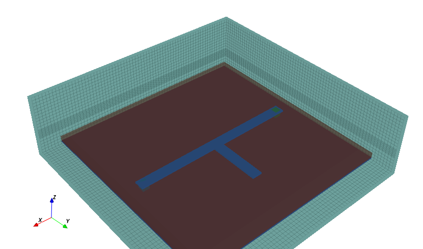

The way the nested grids are set up leads to a duplicate mesh line, which we will look at in "OpenEMS Problem "Energy: ~   nan (- 0.00dB)"".

### Proper Meshing

OpenEMS / FDTD meshing rules of thumb (cited below): http://openems.de/index.php/FDTD_Mesh

Notch filter example (setup of an inhomogeneous FDTD mesh): https://openems.de/index.php/Tutorial:_Microstrip_Notch_Filter.html

#### Rules Of Thumb

The mesh used by the finite-difference time-domain (FDTD) method is a strictly rectilinear mesh using Yee-cells.

* The largest mesh cell must not be bigger than about a tenth of the smallest wavelength. Better: max(Δx,y,z) < λ<sub>min</sub> / 15
* The smallest wavelength is defined by the greatest excited frequency and the material properties!
	- Make the mesh as coarse as possible and as fine as needed
	- Keep an adequate distance to an absorbing boundary
* Try to keep structure > λmax / 4 from a PML
	- Create a smooth mesh: Neighboring cell sizes should not exceed a factor of ~2
	- (paraphrased) The simulation volume necessarily has a significant air space around the active structure to ensure the boundaries do not significantly interact with it.
* Thirds Rule (mostly relevant for PCB simulations, see [discussion](http://openems.de/forum/viewtopic.php?t=801)) : At the edges of a 2D metal you have a strong electric field enhancement that FDTD has trouble to calculate properly. That means that 
	- e.g. for micro-strip line (MSL) the line-impedance and wave propagation differs somewhat between simulation and measurement. 
	- (paraphrased) It is preferred in precision calculations to put mesh lines around a metal edge such that a mixed-material grid cell is 1/3 inside and 2/3 outside the metal.
	- "in other words, the third rule helps to get away with a coarser mesh, if you put a line on the edge, you just use a dense mesh without that advantage"

### Mesh Validation

The mesh resulting from the problem setup and chosen mesh regions / types can be inspected upon execution as AppCSXCAD starts in read-only mode when running the script in Octave. One can add 

```Matlab
mesh.x
mesh.y
mesh.z
```
lines to look at all the numerical values of grid ine positions. Some issues however also become evident rather quickly as the simulation may not run, or yield plausible results:

####  OpenEMS Problem "Energy: ~   nan (- 0.00dB)"
As per http://openems.de/forum/viewtopic.php?t=1103 , one should check the minimum spacing between mesh grid lines. When using multiple overlapping grids that have the same priority level, one would also need to sort them first or otherwise the minimum could be "-65" mm" (in FreeCAD-to-OpenEMS there only seems to be the "top priority, remove overlapping lines" option which currently does not prevent the problem).

As a presumed improvement, one could consider looking for the minimum abs(), inserted before DefineRectGrid():

```Matlab
disp("mesh min spacing x : "), min(abs(diff(mesh.x)))
disp("mesh min spacing y : "), min(abs(diff(mesh.y)))
disp("mesh min spacing z : "), min(abs(diff(mesh.z)))
```

This appears to be unreliable however. The output in a currently problematic case only reflects the intended spacings:
```
mesh min spacing x :
ans = 1.0000
mesh min spacing y :
ans = 1.0000
mesh min spacing z :
ans = 0.2500
```

Since an order is not guaranteed, the mesh entries need to be sorted first. The following lines can be inserted manually into the script after generation, replacing the 

```Matlab
CSX = DefineRectGrid(...);
```

line with:

```Matlab
mesh.x = sort(mesh.x);
mesh.y = sort(mesh.y);
mesh.z = sort(mesh.z);
disp(["mesh min spacing x : " num2str(min(diff(mesh.x)))]);
disp(["mesh min spacing y : " num2str(min(diff(mesh.y)))]);
disp(["mesh min spacing z : " num2str(min(diff(mesh.z)))]);

minimumMeshSpacing = 1E-6;
if ((min(diff(mesh.x)) <= minimumMeshSpacing) || 
    (min(diff(mesh.y)) <= minimumMeshSpacing) || 
    (min(diff(mesh.z)) <= minimumMeshSpacing))
  disp("Minimum mesh spacing violated, removing duplicate entries.");
  mesh.x = uniquetol(mesh.x, minimumMeshSpacing);
  mesh.y = uniquetol(mesh.y, minimumMeshSpacing);
  mesh.z = uniquetol(mesh.z, minimumMeshSpacing);
end

CSX = DefineRectGrid(CSX, 0.001, mesh);
```
 
The code above requires  [uniquetol.m](example_stub_filter/uniquetol.m) which was probably added to Octave 7.1, but not Octave 6.4 [(bug #59850)](https://savannah.gnu.org/bugs/index.php?59850) , so it needs to be added to the script folder.
 
 Now when running the script in Octave, we would get:
```
mesh min spacing x : 1
mesh min spacing y : 1
mesh min spacing z : 3.6689e-16
Minimum mesh spacing violated, removing duplicate entries.
...
 ```
 
 If that does not resolve the issue, the boundary conditions or ports are next to be investigated. In the current case, PML boundary conditions were set up too close to the simulated geometry (they appear to eat into the volume, using existing grid units). Additionally, PML count of 1 is not appropriate, 4 works. Multiple cell thickness is preferred (e.g. 8). 
 
 
# Solution and Visualization 

* Now is a good time to click "Save Current Settings", which produces an .ini file in the project folder.
* Note under ``Postprocessing`` there is a ``Write ABORT simulation File`` button, which creates a file named "ABORT" in the ``tmp/`` subdirectory of the project folder to cause OpenEMS to exit when it is being run from Octave, which will come in handy later.
* Also note the ``Generate just simulation preview`` option that allows to run the Octave script just with AppCSXCAD to preview the model and meshing. 
 
 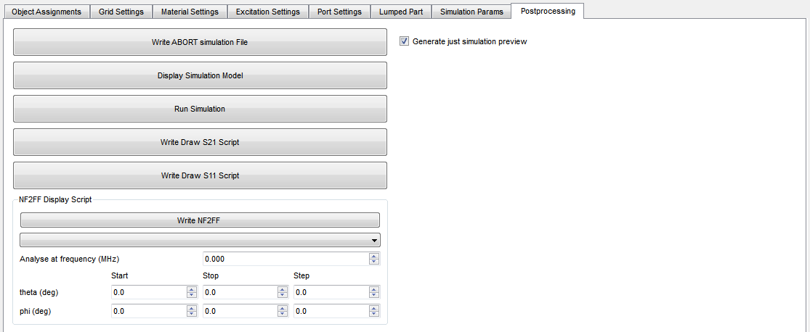
 
 
 When ready, 
  * click ``Generate OpenEMS Script`` in the bottom right corner of the Exporter dialog.
 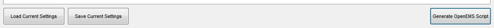 
 * Open the .m file with the project name in the project folder with Octave and run it.
 * Preview the simulation model and mesh.
 * Un-tick  ``Generate just simulation preview`` and re-generate the script.
 * To the .m file, add the mesh validation code from above as needed (it will be removed from the script each time it is being generated. Use the ``ABORT`` file during debugging if there are problems during OpenEMS execution.
 
 Here's what the output in the Octave ``Command Window`` could look like:
 
```
remove entire contents of tmp? (yes or no) yes
mesh min spacing x : 1
mesh min spacing y : 1
mesh min spacing z : 3.6689e-16
Minimum mesh spacing violated, removing duplicate entries.
invoking AppCSXCAD, exit to continue script...
QCSXCAD - disabling editing
QCSXCAD - disabling editing
args = "002.xml"
 ----------------------------------------------------------------------
 | openEMS 64bit -- version v0.0.35-74-g0e54fbf
 | (C) 2010-2018 Thorsten Liebig <thorsten.liebig@gmx.de>  GPL license
 ----------------------------------------------------------------------
        Used external libraries:
                CSXCAD -- Version: v0.6.2-103-g3c4fb66
                hdf5   -- Version: 1.8.12
                          compiled against: HDF5 library version: 1.8.12
                tinyxml -- compiled against: 2.6.2
                fparser
                boost  -- compiled against: 1_60
                vtk -- Version: 8.2.0
                       compiled against: 8.2.0

Create FDTD operator (compressed SSE + multi-threading)
FDTD simulation size: 70x70x29 --> 142100 FDTD cells
FDTD timestep is: 7.86218e-13 s; Nyquist rate: 141 timesteps @4.51033e+09 Hz
Excitation signal length is: 1822 timesteps (1.43249e-09s)
Max. number of timesteps: 100000 ( --> 54.8847 * Excitation signal length)
Create FDTD engine (compressed SSE + multi-threading)
Running FDTD engine... this may take a while... grab a cup of coffee?!?
[@        4s] Timestep:          455 || Speed:   15.9 MC/s (8.928e-03 s/TS) || Energy: ~4.73e-16 (- 0.00dB)
[@        8s] Timestep:          910 || Speed:   15.4 MC/s (9.220e-03 s/TS) || Energy: ~1.03e-13 (- 0.00dB)
[@       12s] Timestep:         1470 || Speed:   19.4 MC/s (7.327e-03 s/TS) || Energy: ~8.88e-14 (- 0.69dB)
[@       16s] Timestep:         1890 || Speed:   14.9 MC/s (9.546e-03 s/TS) || Energy: ~4.38e-14 (- 3.77dB)
[@       20s] Timestep:         2415 || Speed:   18.6 MC/s (7.633e-03 s/TS) || Energy: ~4.02e-15 (-14.13dB)
[@       24s] Timestep:         2905 || Speed:   16.9 MC/s (8.425e-03 s/TS) || Energy: ~6.43e-16 (-22.10dB)
[@       28s] Timestep:         3430 || Speed:   17.3 MC/s (8.191e-03 s/TS) || Energy: ~5.38e-17 (-32.87dB)
Time for 3430 iterations with 142100.00 cells : 28.81 sec
Speed: 16.92 MCells/s

>>
``` 

When successfully completed, a set of files starting with ``tmp/electric field_0000000000.vtr`` will be written to the temporary folder, ready for inspection with ParaView.

* Import multiple files by clicking he grouped .vtr files.
* In Pipeline Browser, click the eye icon to enable visibility.
* Select Represenation = Surface.
* Select Coloring = E-Field.
* Click Coloring button "Rescale to data range over all timesteps.

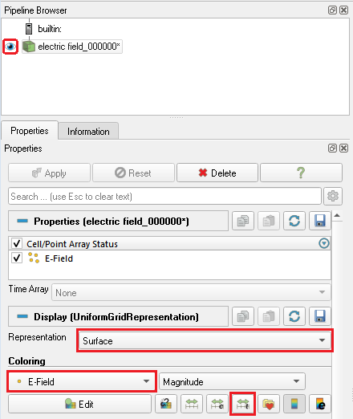

* select loop playback in the top toolbar.
* Press play.

For further help, please also check out the [OpenEMS Forum](https://openems.de/forum/).