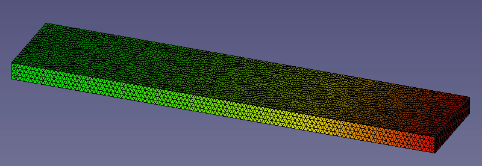
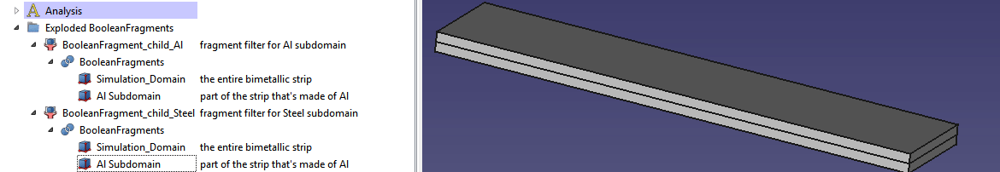
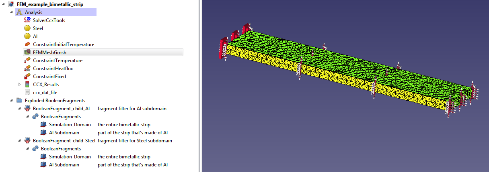

# Multi-Material Finite Element Simulation: bimetallic strip

The rigid connection between objects with different coefficients of thermal expansion, and the [bimetallic strip](https://en.wikipedia.org/wiki/Bimetallic_strip) in particular is probably the first class of problems beyond introductory "one homogenous piece of material" that changes the design process towards a proper simulation model: object types and operations need to be chosen such that they produce benign simulation geometry.

For the sake of clarity, 
* the workpiece consisting of two different material domains will be called "the strip"
* the strip coincides with the simulation domain and the meshed region
* the material domains (steel and Al for simplicity) will be identified by their material types.

## Approaches that don't work

At of the time of writing, FreeCAD 0.20 does not support meshing across multiple objects, and does not support the use of multiple meshes in one simulation. The use of multiple meshes or mesh subdomains would also lack other motivation (like parallel processing, see [Domain Decomposition](https://doc.freefem.org/documentation/ffddm/introduction-to-the-domain-decomposition-method.html)). 

Older tutorials that are now outdated due to changes in the UI and steps:

* [0.17 - FreeCAD FEM Tutorial thermomechanische Analyse eines Bimetallstreifens](https://www.youtube.com/watch?v=Qbif13e2iyo)
* [0.18 -FreeCAD FEM Tutorial - Unterschiedliche Materialien in einer linear mechanischen Analyse](https://www.youtube.com/watch?v=T-ggqH3tXHs)

## An approach that works

Below, an attempt to follow FreeCAD nomenclature (see [Glossary](https://wiki.freecadweb.org/Glossary)) will be made.

The process starts in the ``Part Workbench``.There may be a more convenient approach, but for two material subdomains, the method below should be the least amount of trouble. 

Instead of the logical approach - one would assume that two ``Solid`` objects touching at one of their faces should be created - A larger ``Solid`` in the shape of a Boolean union of both metal bits is created first. Secondly, a smaller ``Solid`` object ( a ``Cube``) is created and positioned such that it is inside the larger one, or touching from the inside.

Next, the material subdomains will be derived:

1. A  ``Compound`` (group of unfused objects), but  more precisely a ``CompSolid`` (``Compound`` where all solids are non-overlapping, are connected by faces and have no non-manifold connections) will be created.  For N different subdomains,  this ``CompSolid`` will consume  the whole simulation domain and N-1  ``Solid`` input objects corresponding to subdomains associated with prescribed materials. 
2. Instead of fusing input objects with a ``Boolean`` operation, the ``Part Workbench`` operation ``Split`` → ``Boolean Fragments`` shall be used. This produces a [``BooleanFragments``](https://wiki.freecadweb.org/Part_BooleanFragments) object. The ``Boolean Fragments`` mode is ``Standard``.
3. Use ``Part Workbench`` → ``Compound tools`` → ``Explode compound`` on the ``Boolean Fragments`` object to get a group "Exploded BooleanFragments" of ``Compound Filter`` objects extracting face-connected, non-overlapping ``Solid`` items. 
4. The input ``Solid`` subdomains have re-emerged as ``BooleanFragments`` child objects as long as they only overlap with the simulation domain. Otherwise, they will be missing the bits where ``Solid`` input objects mutually overlap. The latter will show up as additional ``BooleanFragments`` child objects (to be avoided unless they can be assigned a meaningful material).
5. The Nth ``BooleanFragments`` child object is among the filters and can be selected as a subdomain in the dialog of a particular material.

### Analysis: Meshing, Materials and Constraints

In a minor departure from the first tutorial above, the surface temperature can also be set on all surfaces. Round numbers for temperatures in Kelvin can be used to keep things simple. The rear face which has ``ConstraintFixed`` assigned to it would need to be allowed to expand as well, but for that, an additional object would need to be introduced outside the simulation domain which only provides a fixed face for ``Constraint contact``.

For brevity, the project file can be downloaded [here](FEM_example_bimetallic_strip.FCStd).

It has also been found that writing the ccx .inp file can take between 100 and 2000 seconds. It is not clear to the author whether this is a bug, or simply due to a slow, single-threaded implementation, but eventually FreeCAD will un-freeze and the simulation can be started (assuming no errors have been reported).

The complete Analysis configuration contains selected materials with their corresponding subdomains assigned, constraints on all faces, and in this case, simulation results.

