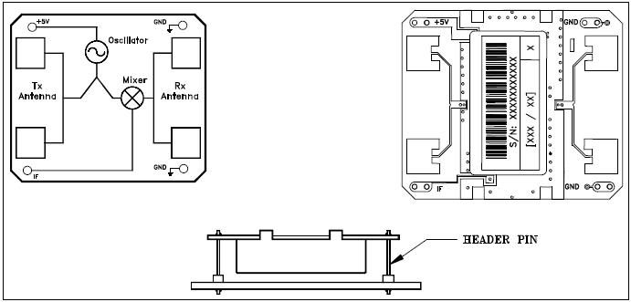
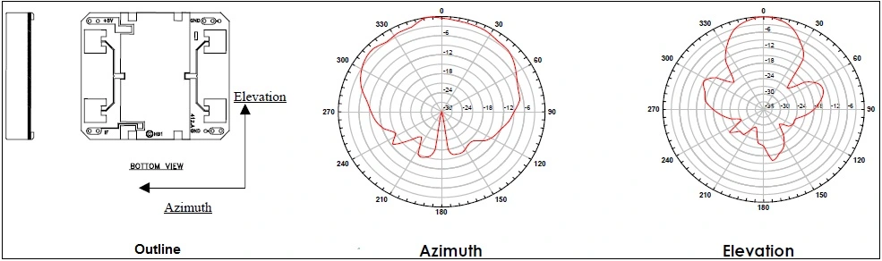
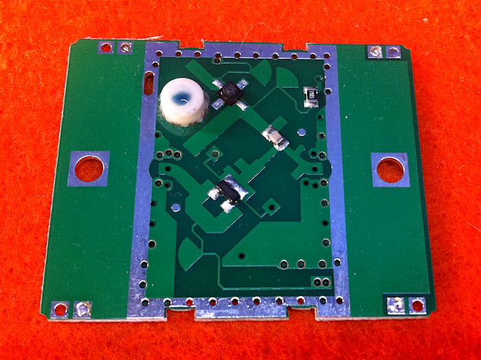
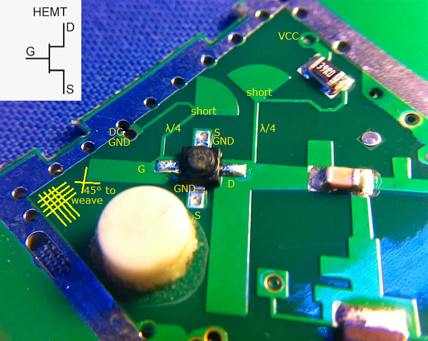
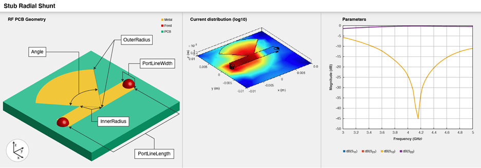
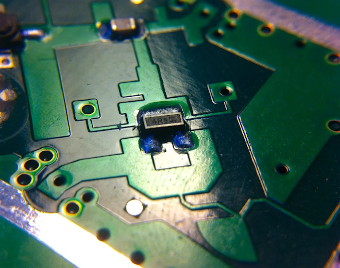
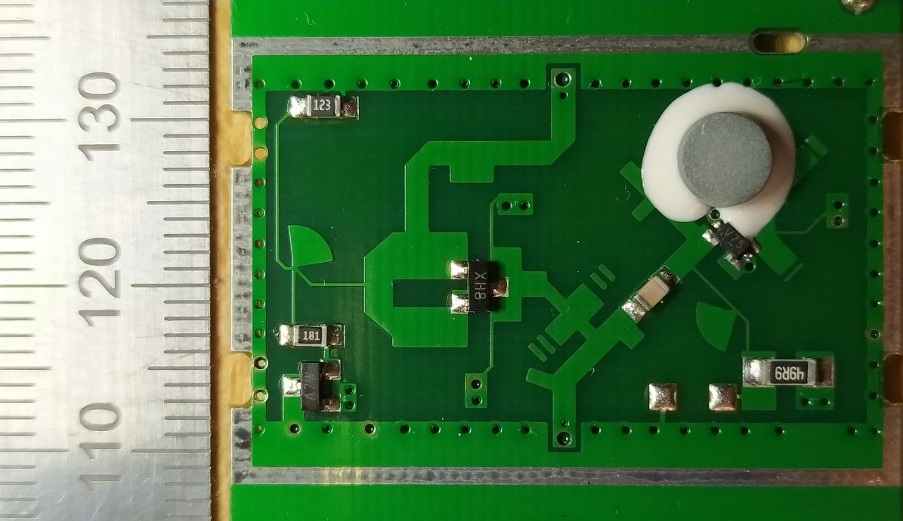
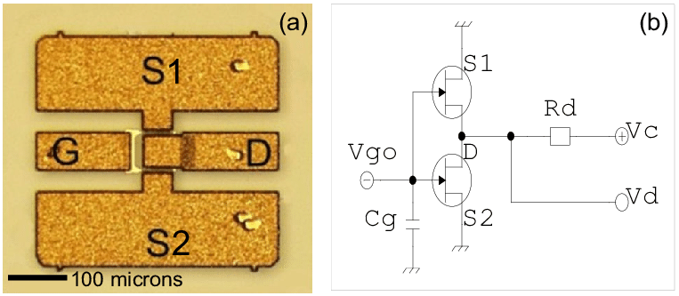

HB100 are 10.525+/- 0.005 GHz Doppler radar modules containing a Ba2Ti9O20 dielectric resonator oscillator (DRO) and a single transistor in the receive path for mixing and demodulating.

Datasheet: [HB100 Datasheet](data/HB100_Microwave_Sensor_Module_Datasheet(1).pdf)
Summary: https://www.electroschematics.com/hb100-microwave-motion-sensor-an-introduction/
Teardown: https://www.allaboutcircuits.com/news/teardown-tuesday-hb100-doppler-radar-module/
More detailed analysis of a similar module: http://www.kerrywong.com/2017/09/01/teardown-and-experiments-with-a-doppler-microwave-transceiver/

## Module Overview

### Properties and Operating Conditions

Other values are 37mA (typ), 60 mA (max) mentioned [here](https://www.botnroll.com/en/outros/1032-hb100-miniature-microwave-motion-sensor.html). 

### Functional Block Diagram

### Patch Antennas

In the elevation direction, two patch antennas (same phase) are stacked on top of each other and spaced such that the beam is squeezed in that direction (40° by 80°).

## Teardown and Analysis

### Circuit Overview

With the shielding can removed, three RF components are visible. Since a metal plate above the ceramic dielectric cyclinder can be used to tune DROs, operation without the shielding can will not be nominal / detuned.
The blue droplet on the cylinder is probably the initial tuning to absorb manufacturing tolerances. The thick traces at center left and center right are the connections to the patch antennas on the other side.

Two stripline segments are used to couple to the DRO. The RF transistor forming the oscillator is unlikely to be a bipolar transistor, as the feedback side has a DC connection to GND, with its adjacent pins also connected to the groundplane (solder-filled vias). 

The antenna side is noteworthy for one thing: all vias are either VCC, IF, RX, TX or GND. With no indications for multi-layer construction, this means that G, S and TX have a DC connection to GND and there's no internal bias going to the mixer component.

### Oscillator Transistor Identification

NPN-Transistors (like BFP620FH for operation up to 12 GHz, SiGe:C) would require a bias tee. A typical depletion-mode device for this PCB would be an n-channel jFET.

The unusual plastic package can be identified as `Micro-X`, in which GaAs [pHEMT](https://en.wikipedia.org/wiki/High-electron-mobility_transistor) FETs are availble for frequencies up to 12 or even 20 / 24 GHz:

- [ATF35376](https://enigma-shop.com/component/hikashop/product/cid-1120) , [ATF10136](https://www.rf-microwave.com/en/agilent-technologies/atf-10136-tr1/low-noise-gaas-fet/atf-10136/) (HP)
- [NE3515S02](https://www.renesas.com/us/en/general-parts/ne3515s02-low-noise-gaas-fet-hj-fet) (Renesas)
- NE3503M04 (NEC)
- [MGF4963BL](https://www.anglia.com/newsarchive/2696.asp) (Mitsubishi)
- [CE3512K2](https://www.cel.com/documents/datasheets/CE3512K2.pdf)  /  [[data/CE3512K2.pdf]] , **[CE3520K3](https://www.cel.com/documents/datasheets/CE3520K3.pdf)** (California Eastern Laboratories (CEL), https://www.cel.com/components/phemts/) 

It is likely that HB100 features a CE3512K2. In the image below, some essential aspects of the DRO are overlaid:
- Drain is connected to VCC through a 39R resistor.
- The feedback side (Gate) is biased to GND.
- λ/4 stubs produce HF "open" conditions at their tap-off points (+90° propagation, -180° due to short, +90° propagation). (see [Quarter-wave Tricks](https://www.microwaves101.com/encyclopedias/quarter-wave-tricks) and [Microstrip Open Radial Stub Block](https://space.mit.edu/RADIO/CST_online/mergedProjects/DES/components/block/common/microstripopenradialstubblock.htm))
- the 45° orientation w.r.t. circuit board weave directions helps average out permittivity fluctuations across the surface and makes the PCB perfromance more reproducible.

Mfr. Part # CE3512K2-C1, LCSC Part # C3277289, Mouser 551-CE3512K2-C1, Digikey CE3512K2-C1CT-ND appears to be a plausible match wih a readable "C" and the datasheet mentioning "C5". $0.20 / 1k also seems to be a desirable price point for low-cost production.

[Simulation](https://de.mathworks.com/help/rfpcb/ref/stubradialshunt.html) of the current distribution in a radial stub demonstrating visualizing how it is indeed an HF short circuit: Hardly any current reaches the rear port, while most of it flows along the stub surface:

### Mixer

- "4R" : OnSemi [MMBV3700](data/MMBV3700LT1-D.pdf) - VHF pin diode across 1-3? Pin 2 not connected.

No HF transistors with "4R" marking were found. It could be that it was found that a simple diode would be sufficient to achieve some level of mixing / demodulation.
The two vias left and right of pin 3 go to the GND polygon beneath, while the RX patches and IF output connected to it through another open radial stub are floating, and will be loaded to GND through the IF preamp stage. 

The U-shaped trace probably amounts to a 180° phase shift, and would have allowed a bipolar Doppler waveform to be received, if not for the missing second diode. 

### Operating Point

HB100 allegedly has a maximum operating voltage of 5.25V.  CK3512K2 has an absolute maximum Drain-Source voltage of 4V. Noting that this device has a junction gate, no positive gate voltages are allowed. 39R in the Drain line seems low, as the transistor typical operating point is specified around Vds ~ 2V, with a maximum dissipation of 125 mW. 

[CE3512K2](https://www.cel.com/documents/datasheets/CE3512K2.pdf) (LCSC # C146230, C3277289):

[CE3520K3-C1](https://www.lcsc.com/product-detail/MOSFETs_California-Eastern-Laboratories-CE3520K3-C1_C3288015.html) (LCSC # C3288015):

Which one is more likely to be used? At $0.31/1k, CE3520K3-C1 is still a low-cost part and use is not ruled out. Speculation: Modules might be populated with CE3512K2-C1 or CE3520K3-C1, depending on availability.

### Measurements

A pack of 5 HB100 modules was procured from ebay/AliExpress sellers. It's immediately obvious that different parts are used.

Parts:
- "V75" M04 : CEL [NE3503M04](data/NE3503M04.pdf) 12 GHz GaAs HJ-FET
- "XH8" SOT23: Skyworks [SMS7621-006LF](data/SMS7621.pdf) Schottky diode (Reverse Series Pair)
- "A7W" SOT23: NXP [BAV99](data/BAV99_SER.pdf) clamping diodes (1-2 and 2-3, used in anti-parallel configuration).
- gray ceramic cylinder: BaTiO3 ? dielectric resonator for 10.5 GHz
- unpopulated: Zener diode or Schottky diode for reverse polarity and perhaps OVP.

Based on own tests, up to 2.5V (Vds=0.80V) and 34mA, the oscillator does not seem to start. At 2.6V, a drop in operating current to 16 mA was observed. 
Without the lid, the board draws 40mA at 3.0V (Vds=1.00V), most likely without oscillation. 

[NE3503M04](data/NE3503M04.pdf):

Just how tiny the structures in such FETs are can be seen below. Process variations aside, there is invariably a difference beween steady-state and instantaneous forward voltages. 

## Summary

HB100 modules contain one 12 GHz GaAs heterojunction FET (pHEMT) used in a barium titanate dielectric resonator oscillator and a package with one or more diodes for mixing / demodulation. Differences in color may indicate BaTiO3, Ba2Ti9O20 \[2\] or other types and additives, which may vary in their dielectric constant and achievable Q factor (3000-8000).
Components were identified by type, package and code, as far as possible. Such investigation always brings up interesting low-cost finds which may inspire other projects and experimentation.
New images of the revised version of HB100 sensors were taken, along with a steel ruler in the same plane, so that it's possible to model the layout and investigate it with FEM or FDTD analysis.

## Outlook

HB100 modules are essentially DROs with the bare minimum in terms of receiver / mixer circuity. They don't need to be fixed frequency oscillators though. \[4\-6\] show another strip line can be coupled to a DR mode such that a varactor diode allows tuning over a few to a few tens of MHz. It might also be possible to attach a tuner PCB on top of the DR cylinder.

## References

1. Beiki, T., Hosseinipanah, M. Harmonic suppression in short-circuited stub bandpass filter by means of a new miniaturized bandstop filter. _Analog Integr Circ Sig Process_ **96**, 589–596 (2018). https://doi.org/10.1007/s10470-018-1230-5
2. J. K. PLOURDE; D. F. LINN; H. M. O'BRYAN Jr.; JOHN THOMSON Jr. (1975). Ba2Ti9O20 as a Microwave Dielectric Resonator. , 58(9-10), 418–420. doi:10.1111/j.1151-2916.1975.tb19013.x  
3. Ortolani, Michele & Di Gaspare, A. & Giovine, Ennio & Evangelisti, F. & Foglietti, Vittorio & Doria, A. & Gallerano, Gian Piero & Giovenale, Emilio & Messina, G. & Spassovsky, Ivan & Lanzieri, C. & Peroni, Marco. (2009). Imaging the coupling of terahertz radiation to a high electron mobility transistor in the near-field. Journal of The European Optical Society-rapid Publications - J EUR OPT SOC-RAPID PUBL. 4. 10.2971/jeos.2009.09006. [RG](https://www.researchgate.net/publication/243582888_Imaging_the_coupling_of_terahertz_radiation_to_a_high_electron_mobility_transistor_in_the_near-field)
4. Won Il Chang Chul Soon Park , "Implementation of a Pldro with a Fractional Multiple Frequency of Reference," _Progress In Electromagnetics Research Letters_, Vol. 46, 13-18, 2014.  [doi:10.2528/PIERL14021802](http://dx.doi.org/10.2528/PIERL14021802)   [http://www.jpier.org/PIERL/pier.php?paper=14021802](http://www.jpier.org/PIERL/pier.php?paper=14021802)
5. Jeon, Y., & Bang, S. (2017, July 31). New Configuration of a PLDRO with an Interconnected Dual PLL Structure for K-Band Application. _Journal of electromagnetic engineering and science_. Korean Institute of Electromagnetic Engineering and Science. https://doi.org/10.5515/jkiees.2017.17.3.138
6. K. W. Lee and W. R. Day, "Varactor Tuned Dielectric Resonator GaAs FET Oscillator in X-Band," _1982 IEEE MTT-S International Microwave Symposium Digest_, Dallas, TX, USA, 1982, pp. 274-276, doi: 10.1109/MWSYM.1982.1130688.
