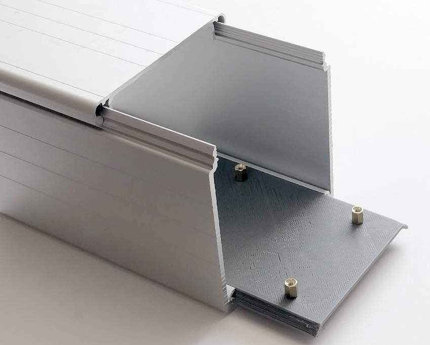
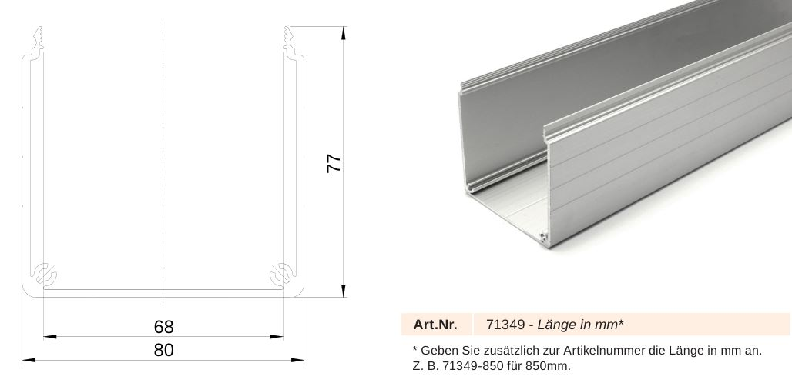
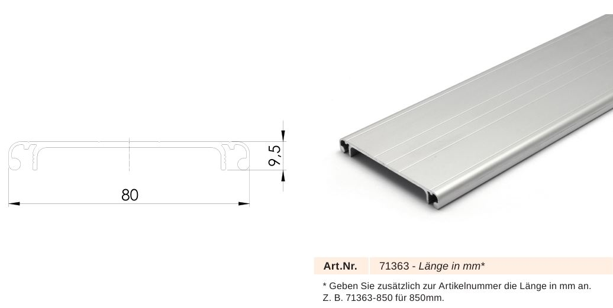
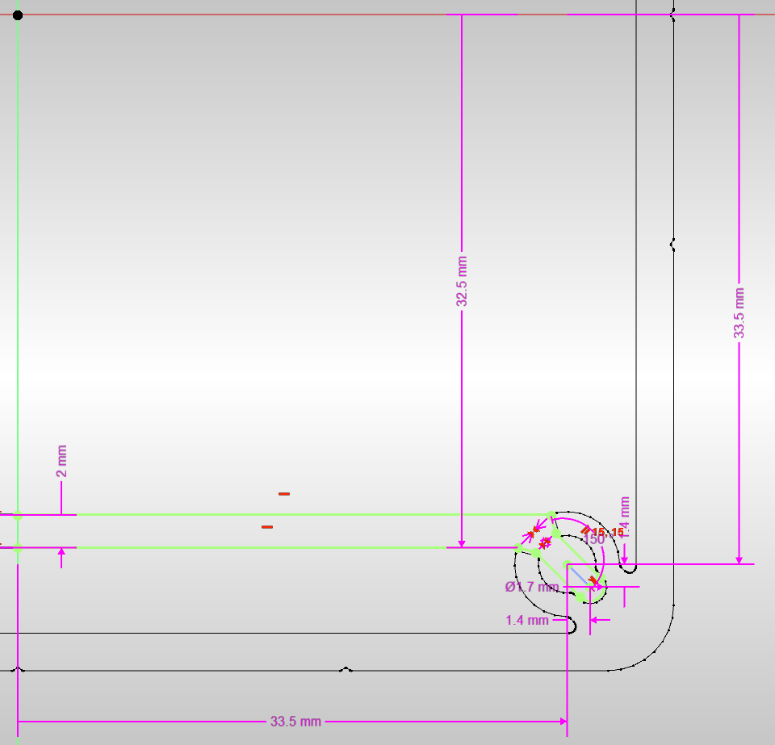
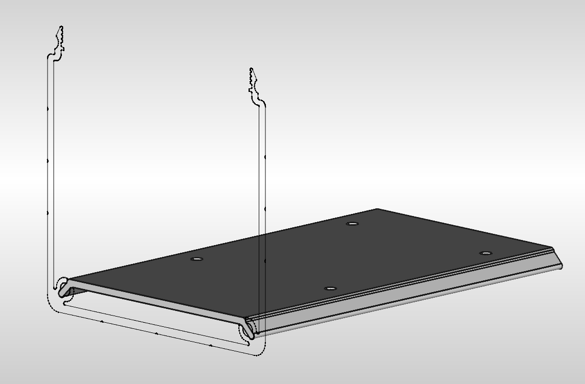
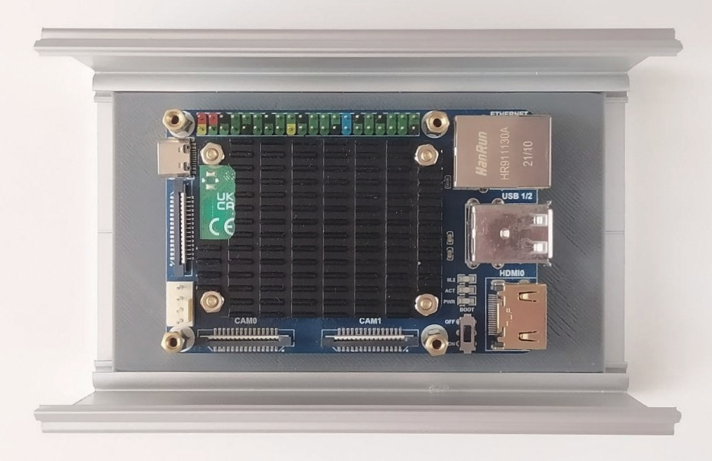

# RPi enclosure from 80x80 anodized conduit

80x80 anodized cable channel profile can be turned into customized enclosure by adding end caps and a PCB carrier insert - the latter of which is provided herein as a design suggestion.

## Material

 [conduit profile source](https://www.dold-mechatronik.de/Kabelkanal-aus-Aluminium-80x80-Zuschnitt) 

[matching cover profile source](https://www.dold-mechatronik.de/Kabelkanal-Deckel-aus-Aluminium-80mm-Zuschnitt)

## Design

As a starting point, the [channel profile](data/80x80_profile.svg) (svg) was extracted from the DOLD Mechatronik [catalogue](data/Dold_Mechatronik_Aluminiumprofile_Gesamtkatalog.pdf) (p.155).

[FreeCAD project](cad/insert_125mm_80x80.FCStd)

## Usage Example

## License

FreeCAD project: copyright Helge Wurst 2024.

This source describes Open Hardware and is licensed under the CERN-OHL-S v2.

You may redistribute and modify this source and make products using it under the terms of the CERN-OHL-S v2 (https://ohwr.org/cern_ohl_s_v2.txt).

This source is distributed WITHOUT ANY EXPRESS OR IMPLIED WARRANTY, INCLUDING OF MERCHANTABILITY, SATISFACTORY QUALITY AND FITNESS FOR A PARTICULAR PURPOSE. Please see the CERN-OHL-S v2 for applicable conditions.

Source location: https://github.com/MisterHW/Notes

As per CERN-OHL-S v2 section 4, should You produce hardware based on this source, You must where practicable maintain the Source Location visible on the external case of the Gizmo or other products you make using this source.

## Changes

- 2024-05: initial release
