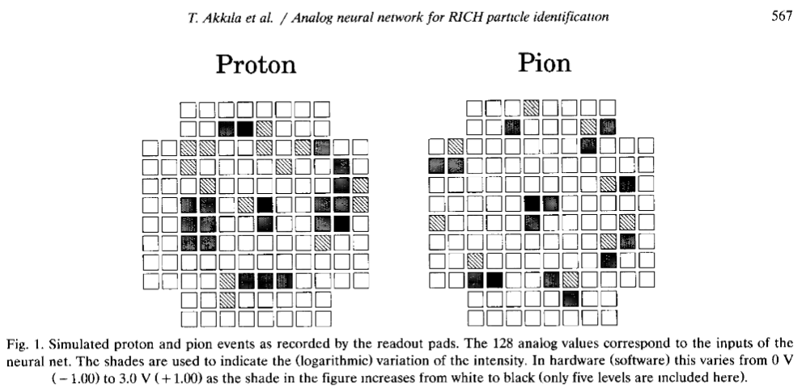
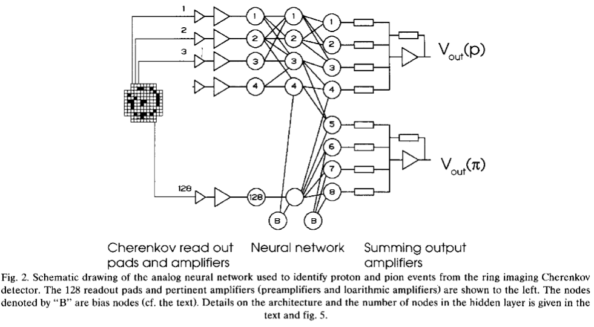
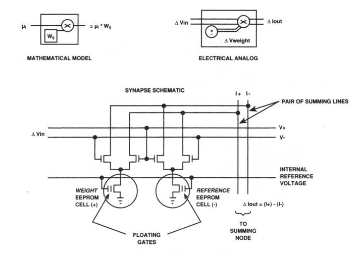
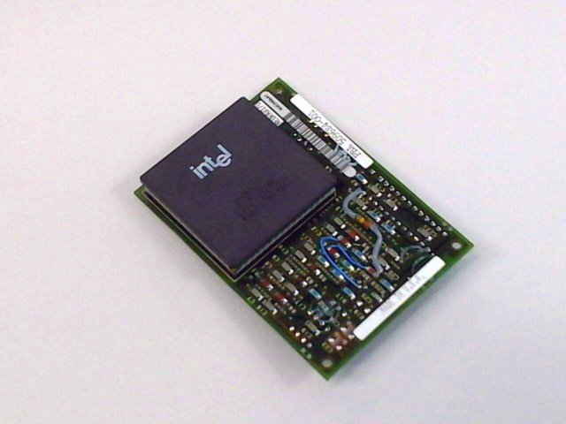
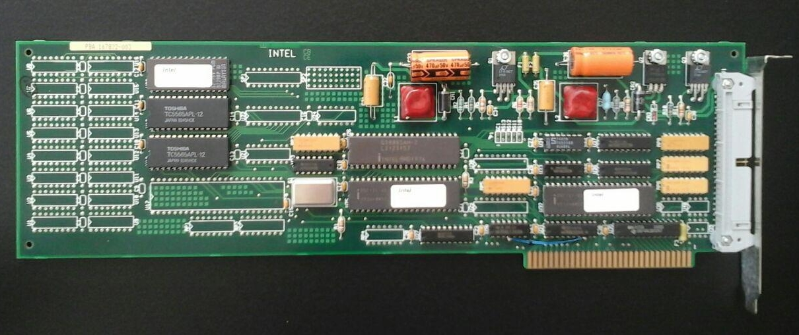
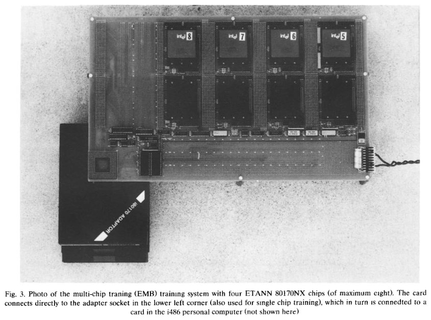
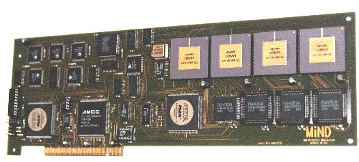

# Analog Neural Networks - The Early Days

Particle physics experiments are traditionally at the forefront of real-time data processing, with detector systems of ever-increasing density, speed and resolution.  It is here where a curious concept for event detection / discrimination based on analog neural networks was evaluated. A [Ring-Imaging Cherenkov Detector (RICH)](https://en.wikipedia.org/wiki/Ring-imaging_Cherenkov_detector) is used for particle type identification when the associated momentum is known, as the angle at which Cherenkov radiation is emitted is related to the particle velocity. 

A system is needed which can evaluate all detector channels in parallel and produce a real-time classification based on the observed angle:

30 years later, the sight of an artificial neural network diagram is nothing surprising. Keep in mind though that all of this was built around analog VLSI circuitry. As outputs, the authors implemented voltages indicating the likelihood of the detection corresponding to a pion or proton transit through the detector medium:

The hardware used was an experimental ANN made by Intel, which probably only really saw the light of day in high energy physics laboratories - the Intell 80170NX ETANN.

## Intel 80170NX - Electrically Trainable Analog Neural Network (ETANN)

The amount of documentation and reports of practical applications of the 80170NX is limited. Being an early and obscure device, no datasheet could be found.

The author was able to procure a copy of the datasheet in paper form. Written by [Warthman Associates](https://www.warthman.com/projects.htm), it is a true testimony to the tradition of technical writing and illustration, and with its unique history, it should be preserved for future generations:

* [Intel 80170NX datasheet](pdf/80170NX.pdf) (20 MB)

Here's is a drawing of the synapse implementation and its conceptual representations:

The key challenge brought about by analog storage of weights with multiple levels is stability of the charge and operating conditions of floating gate MOS transistors. Since this isn't storage of a binary value but rather of a continuous value that needs to stay stable within 1/64 to 1/128 of its range, even 7-8 bit equivalent precision seems ambitious. The fact that this was attempted and had some success at the time is rather remarkable.

As a side note, this was the time where Polaroid patented the use of EPROM memory as a digital image sensor (United States Patent US4803554).

### 80170NX Hardware

The 80170NX engineering samples came in the usual purple ceramic PGA-208C package with a golden lid on the bottom:

Intel also made a training card to be wired up with a wide ribbon cable:

The training adaptor was sadly lost to the dumpster, but can be seen in FERMILAB-TM-1798:

The ultimate undoing of the ETANN chip and a candidate improvement upon it is described in Eppler et al. on their  SAND/1 hardware:

	SAND is manufactured in a 0.8 µm CMOS process, using a sea-of-gates technology with almost 50K Gates. 
	The packaging of SAND is a PGA with 120 signal-pins. The non-linear activation function is calculated by the
	use of a free programmable look-up table allowing for a maximum of flexibility. A controller chip, the memories, 
	the lookup table and the SAND chip are arranged as a fixed modular unit guaranteeing the tight timing for 
	up to 50 MHz operation.
	There are especially three neuro chips available fulfilling partly similar requirements as SAND: the MA16 of Siemens
	[4], CNAPS of Adaptive Solutions [5] and ETANN of Intel [6]. SYNAPSE is a neuro-computer with one MA16. 
	It is available as PC-board [7]. For industrial applications a stand-alone solution without host computer many other 
	chips and at least one micro-controller are necessary. CNAPS and ETANN have problems with their low precision. 
	CNAPS is working with 8 bit accuracy, or 16 bit with less than half the rate. Even worse, the analog ETANN computes 
	with approximately 6 bit accuracy. Sometimes poor accuracy may be compensated by non-linear data 
	transformations, but for on-chip training of the neural network a minimal data length of 16 bits seems to be
	necessary to find the global optimum (but see special example in [8,9] where 4 bits are shown to be accurate
	using tabu search).

## References

* A Study of the Intel ETANN VLSI Neural Network
for an Electron Isolation Trigger.  [FERMILAB-TM-1798](https://lss.fnal.gov/archive/test-tm/1000/fermilab-tm-1798.pdf)
* Akkila, T., Francke, T., Lindblad, T., & Eide, Å. (1993). "An analog neural network hardware solution to a Cherenkov ring imaging particle identifier". Nuclear Instruments and Methods in Physics Research Section A: Accelerators, Spectrometers, Detectors and Associated Equipment, 327(2-3), 566–572. doi:10.1016/0168-9002(93)90726-x
* https://www.freepatentsonline.com/4803554.html
* Eppler, W., Fischer, T., Gemmeke, H., Koder, T., & Stotzka, R. (1998). "Neural chip SAND/1 for real time pattern recognition". IEEE Transactions on Nuclear Science, 45(4), 1819–1823. doi:10.1109/23.710943 [(ResearchGate)](https://www.researchgate.net/publication/3136208_Neural_chip_SAND1_for_real_time_pattern_recognition)
