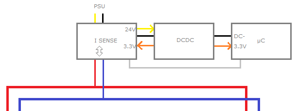
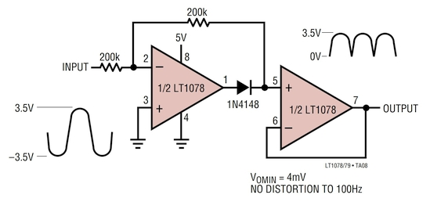
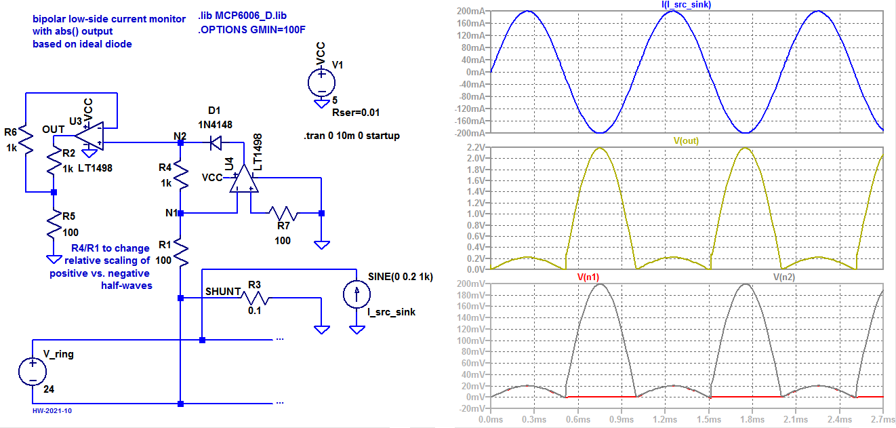

# Current-Sensing For Major Source and Minor Sink Currents

One of those "you got 5 minutes?" questions:  How would you solve the following in a low-cost way:

* A number of boards is connected to a powered ring (24V + RS485 or similar).
* For safety, all boards must monitor the current they draw from the ring.
* One or two boards act as power injectors and have a SMPS connected to them.
* The injected current needs to be monitored as well, and there are MOSFETs to disconnect the supply.

Making all boards the same, the topology would look like this:

The way current sensing is implemented is omitted in the picture above, as there are multiple approaches:

* high-side current sensing,
* low-side current sensing, and
* non-dissipative current sensing with galvanic isolation.

As the power supply negative terminal is not tied to the ring negative line, low-side current sensing can be implemented. 

## A Simple Solution

Now imagine the board either draws 50 mA (200 mA peak), or injects 2 A. When the current direction / polarity is acquired separately, the remaining challenge is to scale 200 mA sink and 2 A source currents to the same ADC range.

After some back and forth, a circuit derived from the  "precision rectifier" opamp circuit became the solution of choice \[1\]:

The circuit shown below reacts to negative shunt voltages like an inverting buffer with a programmed gain of R4/R1. 

Positive shunt voltages with respect ot circuit ground however cause the diode D1 to be reverse biased and essentially no current will flow. Thus, positive shunt voltages are measures with unity gain at this stage. The second opamp stage then provides adequate scaling to the range of the ADC used:

R6 and R7 are approximate compensation resistors, the voltage drop across which would need to match that of the complementary input connected to a voltage source with a Thévenin equivalent series resistance. Due to different conditions in positive and negative shunt voltage cases and the need to consolidate the bill of materials (and adding to that the low value of 100 Ohm to 1 kOhm), approximate values should be fine.

There are some non-linearities when the current changes polarity, but this is not the intended use case, as the role of the board is hard-wired. Changes in current direction are only expected during shutdown and fault events, where capacitors on one of the boards discharge into the ring.

LT1498 was chosen for simulation purposes. Coming in at 20 times the price and 10 times the bandwidth of MCP6006 or MCP6007 (dual package), it is not really necessary for this application. 

## References

1. https://www.analogictips.com/how-does-a-precision-rectifier-work-faq/