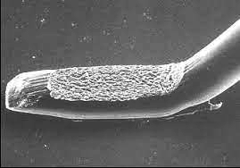

# FEM Simulation of Huffman's Rectangular Woven Origami Design

... and its application in power electronics packaging.

## The Problem

Top-side die attach is the process of joining a semiconductor device - generally having a low coefficient of thermal expansion (silicon: CTE = 2.6 ppm/K) - to an electric conductor.
Barring graphene and carbon nanotubes with near-zero CTE, the conductor is a soft metal - mostly Al (CTE  = 23 ppm/K).

Over their mission profiles, power electronics packaging must ensure the mechanical integrity and proper cooling of the power semiconductors it contains. <!-- Traditionally, the trade-offs for bottom-side die-attach have relied on [stress relaxation](https://doi.org/10.1016/j.ijfatigue.2020.106132) in solder layers at high homologous temperatures, allowing for creep-fatigue over the lifetime of a device.  -->

The requirements include:

* No damage to gate dielectric and metalization.
* Ability to carry nominal currents with acceptable heating.
* Ability to withstand surge currents.
* Low inductance.
* For DSC designs: Top-side heat extraction to a planar interface (lateral heat spreader, DCB).


### Contacts And Their Properties 

Liquid metals aside, the selection of distinct top-side die-attach processes is limited:

* **Wire bonding**: highly mismatched CTE is made up for by small bond foot width and height. Failure occurs through bond wire breakage, heel cracking and interfacial cracking followed by bond detachment.
* **Soldering**: stress relaxation happens in the bulk of the solder joint. High homologous temperature. Creep-fatigue through grain boundary sliding, void formation.
* **Press-pack packaging**: shear stress is limited through strain buffers with low CTE (Mo, W, MoCu, small device can accept Cu contacts) and metalizations (Rh, Pd) which minimize adhesion and frictional wear. Packages are potted with soft compounds or hermetically sealed to minimize oxidation.
* **Transient Liquid-Phase** Bonding: Formation of an intermetallic compound layer at low temperature where a solder alloy is liquid and contains solids of non-alloy elements. The resulting joint is a composite material with higher melting point than the transient liquid phase. Advantage: lower temperature where the structure is mechanically neutral. [Failure of TLPS layers](https://doi.org/10.4271/2014-01-0797) can be comparable to solder layers and benefits from reduced CTE of composite substrates.
* **Low-temperature sintering**: Ag, Cu, Ni, Au pressureless nanoparticle sintering or pressure-assisted sintering of micron and sub-micron particles. Generally characterized by high homologous temperature, moderate CTE and reduced Young's modulus of porous structures when compared to bulk metals. 

In the scope of this writing, wire bonding is perhaps the most relevant structural approach, as the bond foot width of 200-300 µm and height (500-800 µm) are relevant for the following dicsussion. The material is usually Al, but bonding with Cu core Al wire and pure Cu is also demonstrated. Proper top-side metalization remains a challenge though, as the bond forces needed for Cu wire can cause chip damage.

A typical Wedge bond ([source](https://www.knowlescapacitors.com/getattachment/Products/Capacitors/Single-Layer-Capacitor/SLC-High-Reliability/V-Series/Wirebonding-Application-Notes.pdf)):



Soldered and (Ag)-sintered bottoms-side die-attach layers experience crack formation and delamination starting at the outermost corners when subjected to thermal cycling stresses, even when bonded to DCBs with a reduced net coefficient of thermal expansion at the die attach-substrate bond line. Delamination also starts at the outer edges of DCB substrates soldered to baseplates, propagading inwards thoughout the device lifetime.

## The Structural Solution

 When combining
 * the large-area contact of top-side sintered bond buffer layers and
 * the sub-mm contact points of thick Cu wire bonding,
 
there is probably a confluence worth exploring which delivers both high heat removal capability and the ability to limit peak shear stress. Instead of wire bonds, pillars of sintered material could be envisioned.

These pillars could come in the shape of triangles, squares, retangles or hexagons and tile the top-side with small gaps. Such structures would both allow a reduction of shear modulus and allow for lateral thermal expansion of the layer into itself.

Challenges when realizing such structures are:

* Wet and runny sintering pastes (due to solvents wetting the substrate) require multiple printing operations with drying periods in between them. Re-aligning of the stencils is an added effort and stacked printed layers may come with minimum draft angle requirements / stepping.
* Pressure-assisted sintering can cause high-aspect-ratio columns to crumble due to lack of side support, in the same way squeeze-out can be observed when pastes are not fully dried.
* While Ag pastes can tolerate some degree of oxidation, Cu paste bonding ability is drastically reduced in the presence of oxygen during sintering. Pressureless-sintered, porous structures may also be more susceptible to internal oxidation and premature failure.

### Patterned Foils

Instead of forming a continuous sintered die-attach layer, inserting a patterned metal foil at the interface between the chip surface and the sintering material seems to be a possible approach. 

The foil would have folds protruding upwards which would embed small gaps in the sintered layer above, forming the columns we're looking for. Foil surface texture and orientation should prevent the gap walls from sintering together.

While a very thin printed film of pressureless-sintered material would be needed to bond the foil to the top-side chip metalization, once in place the foil could help keep a much thicker layer of Cu paste in place and allow it to dry without forming cracks or flaking off due to contraction. The filling ability could be pre-evaulated by etching thick Cu foil and trying to fill the etched pockets with paste. 

**Which foil pattern would be suitable?**

Considerations:

* Structure needs to have flat contact surfaces on one side where it contacts the chip.
* Checkering is not required.
* Must be able to expand/contract in a plane and do so isotropically.
* Height changes should be minimal.
* Low radial stiffness of the foil itself - no load-bearing directions.
* Aspect ratio of the contact points should be low.

The paper pump egg tray satisfies most of the demands above, however it is stiff when compressed from both in-plane directions and constrained from top and bottom:


Thus, the egg tray structure with its square grid of reinforcing ridges is not adequate. It helps to address another question though: 

**How much contact area is needed?**

One of the most surprising aspects of press-pack packaging is perhaps that while thermal contact is not ideal, top-side contacts can still carry away 20-50% of the heat flux w.r.t. Ag-sintered bottom-side contacts - all while 10-20 MPa of contact pressure only result in contacts through surface asperities that amount to 0.2 to 1% of the total contact cross-sectional area.

The picture below illustrates the effect of paralleled constriction resistances - in particular to heat flux:


Contacts right next to each other see a diminishing return of improved thermal conductivity, as significant resistance is already associated with the narrowing-down of the paths on either side of the constriction.

Essentially, an evenly distributed contact with 25-50% coverage would already be suitable for power electronics packaging. Differences between a full-contact sintered and a foil-structured, columnar layer may become relevant at very short times in Zth relevant for overload conditions, yet it is to be expected that sintered Ag or Cu layers are not inferior to press-pack packages.

With these properties and considerations in mind, a better pattern needs to be found.

### Origami Tesselations - David Huffman's Rectangular Woven Design

In [RECONSTRUCTING DAVID HUFFMAN’S ORIGAMI TESSELLATIONS](https://dspace.mit.edu/bitstream/handle/1721.1/127197/v06bt07a034-detc2013-12710.pdf?sequence=2&isAllowed=y) some remarkable Origami tesselations are reproduced and elucidated.

Reproducing these structures can be recommended and is a great way to get first-hand experience in how such a structure behaves:


When stretching and compressing the structure, it becomes clear that the alternating left- and right-handed spools allow one of the key properties to emerge: the 3x1 rectangles on the other side do not rotate. This is exactly what we want.


Another great tool is https://origamisimulator.org/ which also give easy access to Huffman's Origami tesselations under Examples.

Handling the paper version or even playing with the simulation also exposes that not fully folded tesselations like the one shown below have some degree of spherical curvature:


It is possible to force the structure into a flat sheet. Such action may deform the walls a bit when the struture is made of metal. The large range of motion the paper model has is, however, not needed for the metallic structure, so a 90-95% folded state could be used after flattening.

Unlike paper though, metal can be embossed and drawn into a non-planar sheet before folding, unlocking perhaps the ability to zero out the curvature in an incompletely folded state.


## Thermo-Mechanical Simulation

The folded foil and its sintered filling will invariably have a CTE which is higher than that of the semiconductor they will be sintered to. Before addressing the full simulationand dealing with the challenges of finding good material properties for sintered layers with meso-scale porosity, grain size and potentially varying micro-hardness, The general idea of the proposed foil layer shall be explored.

 The movement of the folds can be explored with two simplified problem setups:
* A purely mechanical simulation where the rectangular contacts are adhered to a plane contracting isotropically.
* A thermo-mechanical simulation where the rectangular contacts are fixed in space as the temperature is increased.

The follow explanations may be easier to follow if we pre-empt the finite element method (FEM) results of the second simulation, where 

* the rectangular contacts are fixed in space and 
* the temperature is changed from 300 K to 500 K (approx. 27°C to 227°C)

The coloring is chosen to represent the maximum shear stress (Tresca):


Among the aspects that are evident at this stage are:

* The spools rotate in agreement with the paper model - but this also means that perhaps a thin layer of resist may need to be printed onto the spools and fold peaks. This will prevent paste from sintering to the spool and locking it in place.
* The gaps between walls can  take up wall deformations and material expansion. 

Failure theories are explained in great detail in the excellent video [Understanding Failure Theories (Tresca, von Mises etc...)](https://www.youtube.com/watch?v=xkbQnBAOFEg) (by *The Efficient Engineer*).

### Tools Used

The problem setup was done in FreeCAD 0.20 using the FEM Workbench and CalculiX solver. Several attempts to model the geometry were made but ultimately unsuccessful:

* Sheet metal forming with a polyhedral die (SheetMetal Workbench).
* Drawing of points and faces to subsequently add thickness to the surface.
* Generating geometry via the OpenSCAD workbench.

Ultimately, the geometry was optimized and exported as an STL file using OpenSCAD 2021.01, then imported in FreeCAD and converted from ``Mesh`` to a ``Shape``, then to a ``Solid``.

The geometry can be checked at each step, which is described in https://github.com/macdroid53/FreeCAD-Tips-n-Workflows#import-stl-files .

### Creating The Model Geometry

We define a basic polyhedron from which the sheet with a defined thickness can be derived:


The unit length can be 1, and the output can be scaled to real-world dimensions. Four of the polyhedra are arranged in a circular pattern which can then tile the plane using ``tool_unit_cell()`` :

```openscad
	d = 0.4;  // draft offset
	g = 0.04; // gap/2
	
	pitch = 4 + 4*d + 4*g;
	
	pts = [
	    // top
	    [-0.5, 1.5, 1],[0.5, 1.5, 1], // 0 1 
	    
	    [-0.5,-1.5, 1],[0.5,-1.5, 1], // 2 3
	    // bottom
	    [-1.5+g,1.5+d, 0],           [1.5-g,1.5+d, 0], // 4     5
	        [-0.5-d, 1.5, 0], [0.5+d, 1.5, 0],         //   6 7
	        
	        [-0.5-d,-1.5, 0], [0.5+d,-1.5, 0],         //   8 9
	    [-1.5+g,-1.5-d, 0],          [1.5-g,-1.5-d, 0] // 10   11
	];
	    
	
	faces = [ // orientation: CW when looking at a face from outside
	    [0, 1, 3, 2],
	    [4, 5, 1, 0],
	    [1, 5, 7],
	    [3, 1, 7, 9],
	    [3, 9, 11],
	    [2, 3, 11, 10], 
	    [2, 10, 8],
	    [6, 0, 2, 8],
	    [0, 6, 4],
	    [4, 6, 8, 10, 11, 9, 7, 5]
	];
	
	
	module tool_unit_cell(){
	for ( i = [0:1:3] ) 
	    rotate([0,0,90*i])
	        translate([-1-d-g,-1-d-g,0])
	             polyhedron(pts, faces, convexity=2);
	}
```

Solid geometry is obtained by generating a ``union`` of the array of polyhedra and a ``cube`` supporting them from below. At this point the geometry looks like a "chocolate bar" where rectangular pieces follow a woven pattern.

To finish the geometry, two of those chocolate bars are subtracted with ``difference``, and before the subtraction the "positive" chocolate bar is thickened by the actual foil thickness through ``minkowski`` with a shape of suitable type and orientation.  The picture below shows a cut-away view of the resulting foil geometry model: 


This would conclude the parametric geometry generation part, were it not for complications cropping up in the actual simulation, or at the meshing stage which can - to some extent - be traced back to overcomplicated or "pathological" geometry (the author has yet to find means to quantify and localize these problems; error messages and outputs are not conclusive).

Even when treating meshing and FEM analysis as a black box operation, a 1x1 unit cell problem can be used with coarse mesh to test various operand shapes:


Here, the problem with the concept of filleting becomes apparent: even if one were to simplify the geometry after the fact, it is perhaps prudent to select an operand shape, orientation and spacings such that benign geometry results.

It was found that when using a ``cube``, the number of simulation elements and their nodes is was lower than for other options by a factor of 2 to 5.

Corresponding files:
* [OpenSCAD script](model and analysis/woven_design_forming_tool_cubemin.scad)
* [STL output](model and analysis/woven_design_forming_tool_cubemin.stl)


### Import and FEM Analysis in FreeCAD

FreeCAD permits native geometry generation via the ``OpenSCAD Workbench`` and ``Add OpenSCAD Element...``. Looking at STL import may be more attractive though, as other tools (MeshLab, NetFabb, ...) maybe be used to prepare and fix the mesh before use in a simulation.

A sane import process for meshes is reproduced below, as described in https://github.com/macdroid53/FreeCAD-Tips-n-Workflows:

The steps to import an STL file:

* Use File>Import to import the STL file
* Or, use Mesh workbench Import Mesh
* use tools in Mesh workbench to verify it is a manifold file
* Mesh workbench Analyze, Fill hole, etc. as needed.
* Use Mesh workbench Decimate
* Reduce as far below 100k triangles as possible.
* use Part workbench Convert to shape
* use Part WB Check geometry to make sure it produced a valid shape
* use Part WB Convert to solid
* use Part WB Check geometry to make sure it produced a valid solid
* if all that was successful, the solid can be used directly with Part workbench
* to use it with Part Design workbench, create a Part Design Body
* drag-n-drop the solid into the Body

From there, An Analysis container is created in the ``FEM Workbench`` and populated:


A material must be added and the solid needs to be added to the objects that have MatrialSolid assigned. 
As the geometry is not sufficiently refined, multiple faces have to be selected to add ``ConstriantFixed`` to all 16 rectangular contacts and ``ConstraintTemperature`` to a more  arbitrary selection of all squares associated with the spools on the opposite sides. 

Testing whether meshes work is a time-intensive process, and ``Netgen`` on its "coarse" setting may yield faster results than ``GMSH``. The worst trial runs in this work took over 400 seconds for meshing and 2000 seconds to compute the simulation, though starting simple - sometimes even with a coarsely meshed mock-up made of cubes and boolean operators on them may be very helpful in getting the overall simulation put together and validated. Mock-ups may also expose bugs and unrelated problems with nightly / weekly FreeCAD builds so you don't waste a day or two trying to pinpoint which apect of a complex model may lead to simulation failures.

The [FreeCAD project file](model%20and%20analysis/WovenDesign_CubeMinkowski-solved.FCStd) without results allows an easy way to investigate other meshing parameters, which may improve accuracy or remove standing issues. 

Currently, there is a small number reported as ill-shaped tets (see related [forum thread](https://forum.freecadweb.org/viewtopic.php?t=68007)), which could not be resolved by changing the meshing parameters, and have been ignored.

#### A Note On Boundary Conditions

Not all faces need to be selected and set to a specific temperature, and not all faces need to have a heat transfer coefficient assigned.

For problems with internal heat sources, the author explored the python command line a bit. While not needed in this case, it should be mentioned that scripting (although somewhat tedious due to patchy documentation) could be regarded as the go-to approach to UI limitations and missing features. 

Information can be found [on github](https://freecad.github.io/SourceDoc/dd/d72/namespaceFem.html), [on the FreeCAD forum](https://forum.freecadweb.org/viewtopic.php?t=48252) and by searching for method names and strings found in the source code (it's a bit like reverse engineering, but searching for Part and Fem namespaces has been helpful).

The script below can be pasted into the command line window, and probably also just saved as a macro and used to generate a new ``ConstraintTemperature`` object based on faces of selected shapes:

```python
#
# Create new Fem::ConstraintTemperature instance with all faces of the selected Shape
# and move it to the active FEM analysis (when in doubt, double-click on it beforehand).
#
import ObjectsFem, FemGui
import FreeCADGui as Gui	
selection = Gui.Selection.getSelection()
Gui.Selection.clearSelection()
refs = []
for selectionItem in selection:
	if hasattr(selectionItem, "Shape"):
		faces = []
		for idx, fac in enumerate(selectionItem.Shape.Faces):
			faceName = 'Face{:d}'.format(idx+1) 
			Gui.Selection.addSelection(selectionItem, faceName)
			faces.append(faceName)
		refs.extend( [(selectionItem, tuple(faces))] )

activeAnalysis = FemGui.getActiveAnalysis() # avoid: activeAnalysis = App.ActiveDocument.findObjects("Fem::FemAnalysis")[0]
if (activeAnalysis is not None):
	if (activeAnalysis.TypeId == 'Fem::FemAnalysis'):
		newConstraint = ObjectsFem.makeConstraintTemperature(App.ActiveDocument, "FemConstraintTemperature")
		activeAnalysis.addObject(newConstraint)
		newConstraint.References = refs
```


## Conclusions

Thermo-mechanical FEM analysis is possible in FreeCAD, allowing an open-source path from concept to post-processing. Limitations become apparent in multi-material problems with arbitrary / more involved geometry. 

The problem above has been investigated as far as its reaction to a temperature change, highlighting the motion that accompanies thermal expansion of protruding folds and spools. The mechanical simulation of an isotropically expanding interface to which the contact rectangles are affixed can be conducted later.

Further information on post-processing and result interpretation (von Mises, Tresca stresses):

* FreeCAD 0.17 coupled structural thermal FEA analysis demo https://www.youtube.com/watch?v=UXjsTeMwr0Q&t=14m20s
* Tachi Lab Artifacts "Freeform Origami" shows how Miura-ori can be deformed to achieve free-form deformation, which may be used here to compensate spherical curvature of incompletely folded rect woven designs https://www.youtube.com/watch?v=T35So_88mio


<!--
https://forum.freecadweb.org/viewtopic.php?style=10&t=68007
https://github.com/macdroid53/FreeCAD-Tips-n-Workflows
https://wiki.freecadweb.org/FEM_ElementGeometry2D

Foils could be processed with embossing and rollers - at least to some extent - which promises a pathway to scalable production. 

https://www.youtube.com/watch?v=T35So_88mio
https://www.youtube.com/watch?v=xkbQnBAOFEg
-->