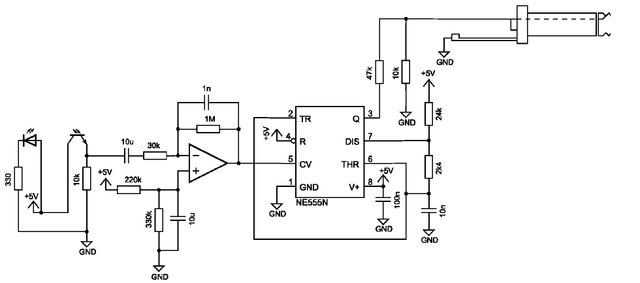
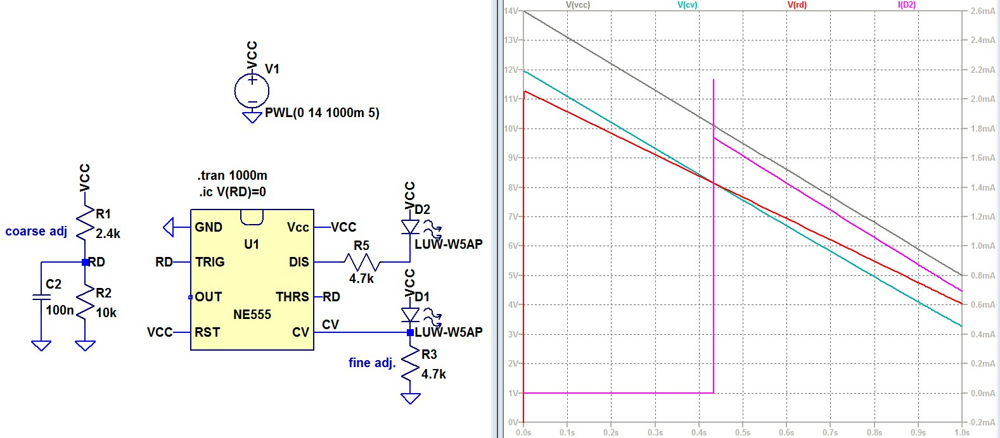

# Under-voltage Detector with An NE555

The challenge [1]:

	You're stuck on a island with a 12 V battery and a 555. 
	Maybe some resistors, diodes, leds, etc, but no other active components.
	How can you make a low-voltage indicator to light at approximately 10V?
	
	
## NE555 As A Comparator

The NE555 timer IC [2] can be used for sever applications that are not strictly about timing. Most importantly, it has an internal voltage divider network, two comparators and a flip-flop with two types of output stages:

The CV pin can be pulled to a voltage within the supply range of the NE555. In timer circuits, the exponential charge / discharge voltage function can be utilized to create voltage-to-frequency converters with monotonous (albeit not linear) relationships, as described in \[3\] by the authors as a circuit intended to easily interface with a PC sound card while avoiding DC coupling issues:

## One Possibe Solution

The introduction above makes clear: all the inputs are fair game when it comes to adapting the NE555 to a given problem. One can also pull CV towards a node that tracks VCC with an offset, while TRIG and THRS, being connected to a resistor divider at RD, are proportional to VCC with some factor.

As a result, the slopes of RD and CV voltages are different, and properly chosen values introduce an adjustable intersection point.

An additional capacitor C2 is added to ensure the flipflop starts out set, and is only reset when THRS reaches CV during operation. This may save one resistor which, together with C2 connector to RST would have served a similar purpose.

One downside is the small difference in slopes, which can introduce temperature dependence and some spread with component values.. but given the crudeness of the application, 2 LEDs, an NE555, 4 resistors and 1 capacitor should meet the requirements.

## Reference

1. https://twitter.com/tedyapo/status/1528097728206618624
2. https://en.wikipedia.org/wiki/555_timer_IC
3. DOI: [10.1109/CINTI.2013.6705184](https://www.researchgate.net/publication/257592174_Low-cost_photoplethysmograph_solutions_using_the_Raspberry_Pi)